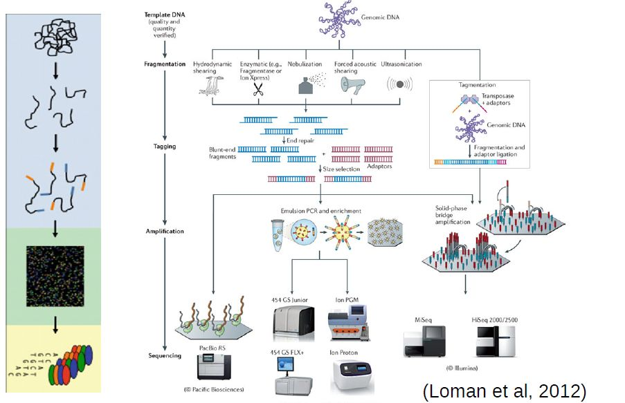

A good source of information for this part is [RNA-seqlopedia](http://rnaseq.uoregon.edu).

## The High Throughput Sequencing Workflow

[Sanger sequencing](https://en.wikipedia.org/wiki/Sanger_sequencing) brought about a technological revolution, as it allowed to directly read DNA molecules with relative ease and affordability. The [Human Genome Project](https://en.wikipedia.org/wiki/Human_Genome_Project) motivated further progress, leading to automated DNA-sequencing machines capable of sequencing up to 384 samples in a single batch using capillary electrophoresis. Further advances enabled the development of high throughput sequencing (HTS), also known as next generation sequencing (NGS) platforms.

At the moment, the high throughput sequencing technology most often used (by far) is Illumina. Similarly to the Sanger method, it is also based on the addition of nucleotides specifically modified to block DNA strand elongation, where each nucleotide is marked with a different color. Unlike the Sanger method, where a single DNA molecule is "read" at a time, modern illumina machines allow reading up to millions of DNA molecules simultaneously.  

## Commmon steps in most high throughput sequencing workflows:

<ul>
  <li>Extraction and purification of the DNA template (even RNA must usually be converted to cDNA)</li>

  <li>Fragmentation of the DNA template (into a size range that can be accommodated by the machine)</li>

  <li>Attachment of sequencing tags (to enable reading by the machine)</li>

  <li>Amplification of signal (usually trough PCR, often already in the machine)</li>

  <li>Reading of signal and conversion into nucleotide bases</li>
</ul>

 

## Paired-end sequencing

Many sequencing machines can read both ends of a fragment. This is called paired-end sequencing.

 
 

## Common parameters to consider when sequencing

When sending your samples to a sequencing facility, these are the most frequent parameters to consider:

  * Single versus Paired-end sequencing

  * Read Length

  * Coverage (number of reads)

 

The following links are a good source of information regarding illumina sequencing technology:
* [Illumina Sequencing by Synthesis](https://www.youtube.com/watch?&v=fCd6B5HRaZ8).
* [Elaine Mardis talk on NGS](https://www.youtube.com/watch?v=v1DbcJD4Ry0).

 

## Considerations when obtaining your RNA.

The first step in a transcriptomic experiment is to obtain the RNA. After isolating total RNA from cells, one can directly sequence it. Nonetheless, the majority of the RNA in a cell is ribosomal RNA, which may need to be removed using specific kits. Moreover, total RNA also contains unprocessed immature transcripts and RNA targeted for degradation (at different stages of processing).

Therefore, unless one is interested in non-coding RNAs or other aspects related to transcription, it is usually better to apply protocols that extract the mature mRNAs (usually through the PolyA tails). Since most people are interested in coding-genes, it is more common to use mRNA-specific protocols.

Some protocols can also keep strand information. In this case, the reads have the same (or the reverse) strand as the transcribed RNA. This is particularly relevant when sequencing total RNA, noticeably to distinguish real transcripts from transcriptional activity resulting from stalled promoters or enhancers. It can also be useful to distinguish between overlapping genes.

Finally, we also need to consider the amount of material available. Are we dealing with samples with a lot of RNA (eg. cell cultures), or short amounts (eg. small tissue samples, single-cell) that are prone to amplification artifacts and presence of contaminant sequences?

## Designing your experiment for differential expression using RNAseq.

Longer read length, paired-end sequencing and strand-specific library preparation are particularly relevant to reveal gene structure. For example, on a non-model organism for which there is no genome sequenced, or the genes are poorly annotated. They are also relevant when alternative splicing is a factor to take into consideration. Discovering gene structure is a complex process and it would be the subject of an entire course on its own.

For this course, we will focus on the analysis of differential gene expression between conditions, on organisms for which gene annotation is available. Under these conditions, long reads, paired-end, and stranded library preparation methods are not as important. Therefore, for this type of experiments, we can safely go for the cheaper single-end sequencing and shorter read lengths (eg. 50bp or 76bp).

To infer genes differentially expressed between conditions, we need to obtain accurate measures of gene expression variance between the conditions. For this, we need replicates containing as much of the expected biological variance as possible. Chosing the number of replicates and depth of sequencing (number of reads) depends on the experiment. For highly controlled conditions (such as cell cultures), 2-3 replicates could be enough. In terms of coverage, 10-40 million reads should be enough to capture most "reasonably" expressed genes. Nonetheless, to be able to more accurately estimate how much is needed, one should always start from [small pilot datasets](http://scotty.genetics.utah.edu/scotty.php), although in practice this is rarely done.

At IGC we mainly use two library preparation methods (both unstranded): [Smart-seq](https://www.takarabio.com/products/next-generation-sequencing/single-cell-rna-seq/ultra-low-input-mrna-seq-for-illumina) and [QuantSeq](https://www.lexogen.com/quantseq-3mrna-sequencing/). QuantSeq is adequate for "normal" bulk samples (with many cells), it only sequences the ends of the transcripts, requiring less reads per sample (because only a small portion of the transcript is sequenced). Since it only sequences a small portion of the transcript, it can only be used for differential gene expression analysis. Smart-Seq, on the other hand, sequences full length cDNAs, and it can be used with bulk samples, as well as with samples with very low numbers of cells, including even single-cell. Specific analysis techniques are necessary for samples with very low cell numbers, which we will cover later in the course.
 
 
 

# 2 - List steps in the analysis of RNAseq differential expression experiments 

Steps in the analysis of RNA-Seq:

  * QC of Raw Data; ([Page 3](L03.md))

  * Preprocessing of Raw Data (if needed); ([Page 4](L04.md))

  * Alignment of "clean" reads to reference genome ([Page 5](L05.md))

  * QC of Aligments ([Page 6](L06.md))

  * Generate table of counts of genes/transcripts ([Page 7](L07.md))

  * Differential Analysis tests ([Page 8](L08.md))

  * Post-analysis: Functional Enrichment ([Page 10](L10.md))

 

### Back

Back to [first page](https://maccardoso.github.io/ADER18S/).
