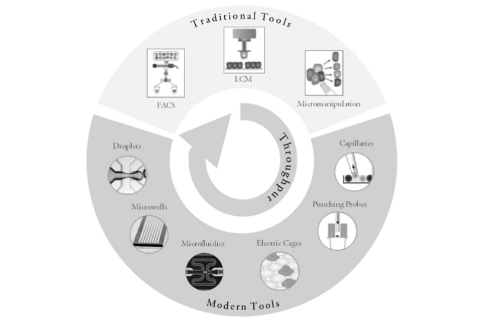
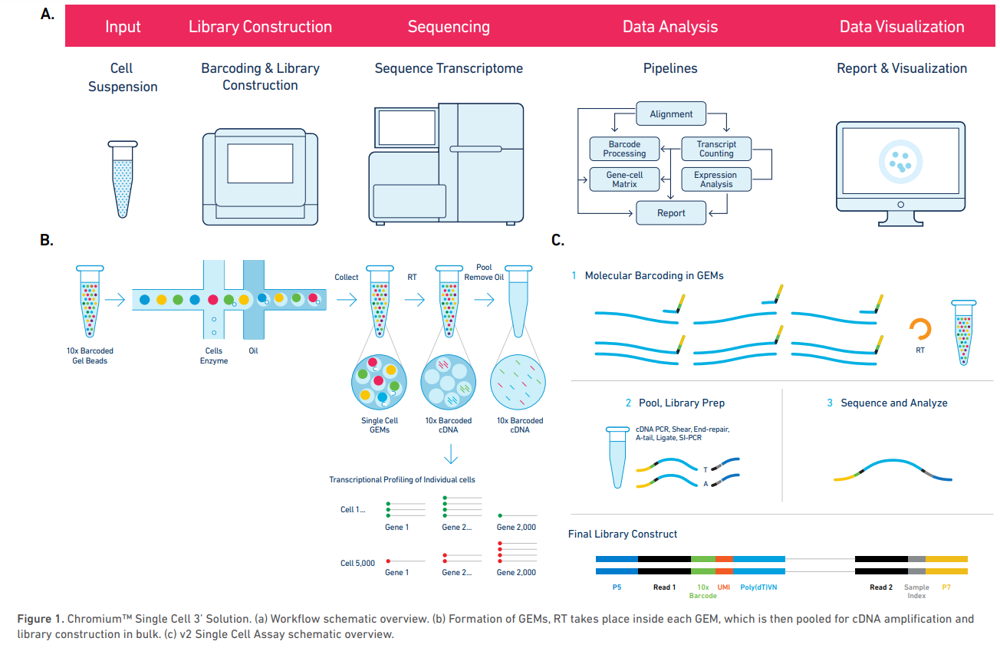
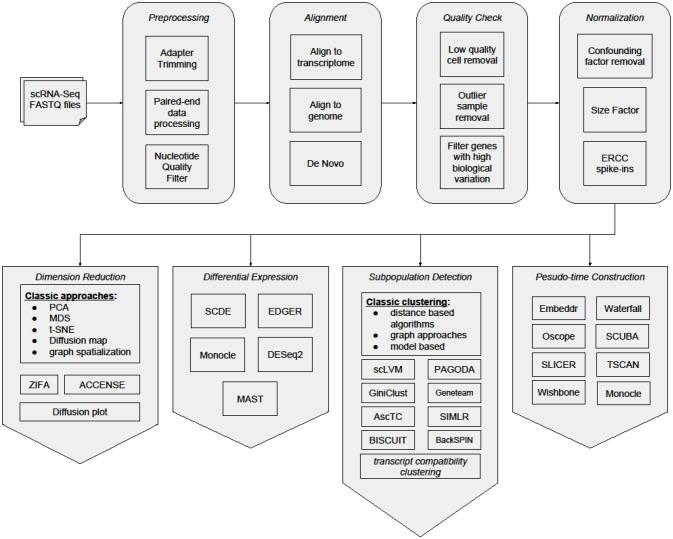
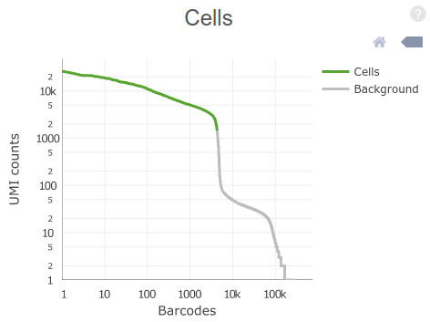
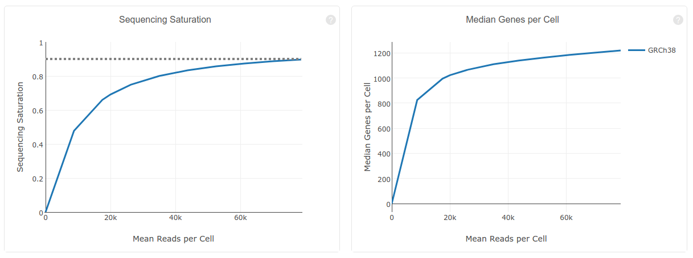
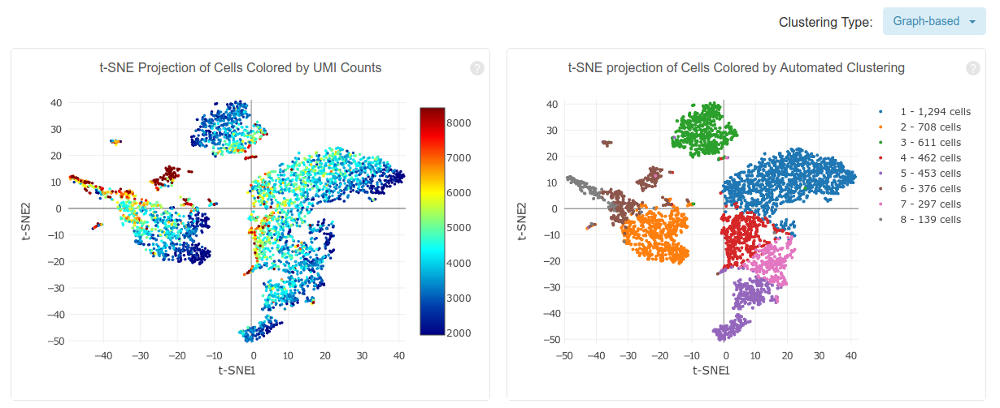
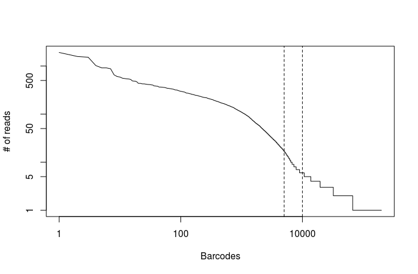
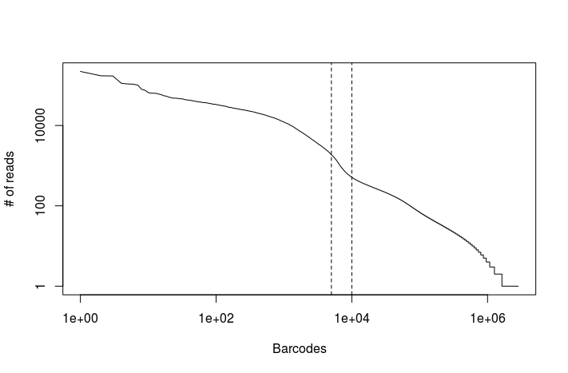
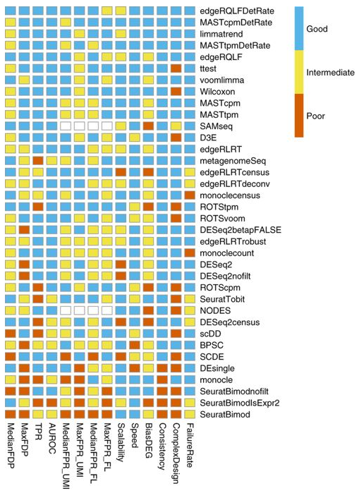

## <a id="LO9.1">9.1 - Overview of Single Cell RNA-seq (scRNA-seq) </a>

*Bulk* RNA-seq captures only an "average" of the expression profiles of thousands of cells. By contrast, *single cell* RNA-seq (scRNA-seq) allows the capture of individual measurements across dozens and up to *thousands* of single cells.

These techniques allow among others, understanding of cell-to-cell heterogeneity, tracing of differentiation pathways, modelling transcriptional dynamics. For an overview of scRNA-seq applications see
[Liu, F1000Research (2016)](https://f1000research.com/articles/5-182/v1), [Griffiths *et al.*, molecular systems biology (2018)](https://onlinelibrary.wiley.com/doi/full/10.15252/msb.20178046).

scRNA-seq starts with the collection of individual cells. Many techniques exist for this purpose, both classical, such as FACS and micromanipulation, and modern, such as microfluidics and droplet based systems. All these differ in their flexibility (e.g. ability to isolate cells based on visual inspection, or from specific locations) and throughput (number of cells able to be isolated and processed).


[Valihrach *et al.*, Int J Mol Sci. (2018)](https://www.ncbi.nlm.nih.gov/pubmed/29534489)

After isolation of the cells, RNA from each cell is reverse-transcribed into cDNA, barcoded with a cell-specific oligo, and then sequenced by high-thoughput sequencing. The origin of each sequenced RNA fragment can be recovered by reading the cell-specific barcode.

### Example platform: Chromium System (10x Genomics)

The Chromium System for scRNA-seq, is a droplet based high-throughput system capable of analyzing 100 to 100,000 cells in a single experiment.

Cells are isolated in *gel bead in emulsion droplets* (GEMs) each carrying a single gel bead, and *zero or more cells* along with and reagents needed for reverse transcription of the cell mRNA. The rate of cell injection in the apparatus is optimized so that most GEMs will not carry any cell, and the vast majority of the remaining GEMs will carry *exactly one* cell, although it is possible that a few will carry more than one cell (these are called *multiplets*).

Within each GEM, the cell mRNA is reverse-transcribed such that its cDNA carries a unique *cell barcode*, allowing posterior identification of the originating cell. Each reverse transcribed molecule will also carry a *unique molecule identifier* (UMI) that, along with cell barcode, allows to discriminate between unique mRNA molecules and PCR amplification artifacts.

After reverse-transcription is completed, the resulting cDNA library is obtained by pooling the cDNA from all GEMs and removing the oil from the solution. This library can then be sequenced by standard short-read sequencing (e.g. Illumina).

Sequencing is done in paired end-mode and, unlike in bulk RNA-seq, the number of cycles (number of bases sequenced) is different for the forward and reverse reads: the first read is 26 bp long and contains the 16 bp *cell barcode* and 10 bp *UMI*, while the second read is longer (100 bp are recommended) and contains the mRNA sequence, sequenced from the 3' end.


[Chromium Single Cell Gene Expression Solution](./images/L09/single-cell/)

### Overview of scRNA-seq data analysis

scRNA-seq data analysis presents a number of challenges, many of which are still the focus of active research, such as:

- High dimensionality;
- Lower depth than bulk RNA-seq;
- High amount of zeros (also called *dropouts*);
- High variability.

The analysis of a scRNA-seq sample, for the purpose of identifying and characterizing cell subpopulations, starts with preprocessing of raw reads, then reads are mapped to a reference genome and quantified in an *UMI count matrix*. Downstream analyses of this count matrix allow the identification and characterization of subpopulations of cells.



[Poirion *et al.* Frontiers in Genetics (2016)](./images/L09/fgene.2016.00163/full)

---

In this course we will fully analyze two sets of raw data: a sample of ~4,000 human peripheral blood mononuclear cells from 10x Genomics, and one sample of ~3,000 mouse lung cells from the [Mouse Cell Atlas](https://doi.org/10.1016/j.cell.2018.02.001). For each dataset, we will start from the raw fastq files, obtain a UMI count matrix and, through downstream analysis of this matrix using the R package [*Seurat*](https://satijalab.org/seurat/), identify clusters of cell subpopulations and marker genes for each subpopulation.

## <a id="LO9.2">9.2 - Generate a count matrix for a single-cell RNAseq dataset </a>

**Preprocessing**

As in bulk RNA-seq, FastQ files preprocessed in order to remove adapter sequences and low quality nucleotides (from the RNA read only).

*Cell barcodes* and *UMI* sequences are extracted from the first read in order to keep track of cells and unique molecules. Different strategies can be used to account for sequencing errors, such as collapsing *barcodes* or *UMIs* that only differ by a singe nucleotide.

**Mapping and quantification**

Reads are mapped to a reference genome or transcriptome. Here, only the second read is used for mapping (in single-end mode), as the first read does not contain the mRNA sequence, only the *cell barcode* and *UMI* of the original molecule.

In order to contruct a *UMI* count matrix, reads mapping to each gene are counted, and then split by *cell barcode*. In order to account for PCR amplification bias, mapped reads containing the same *cell barcode* **and** *UMI* are collapsed (i.e. they are counted only once).

### Obtaining an UMI count matrix and preliminary analysis using Cell Ranger (10x Genomics)

In the first task we will use an example dataset available from the 10x Genomics website.

> [**4k PBMCs from a Healthy Donor**](https://support.10xgenomics.com/single-cell-gene-expression/datasets/2.1.0/hgmm_100).
>
> Peripheral blood mononuclear cells (PBMCs) from a healthy donor (same donor as pbmc8k). PBMCs are primary cells with relatively small amounts of RNA (~1pg RNA/cell).
>
> - 4,340 cells detected
> - Sequenced on Illumina Hiseq4000 with approximately 87,000 reads per cell
> - 26bp read1 (16bp Chromium barcode and 10bp UMI), 98bp read2 (transcript), and 8bp I7 sample barcode

This dataset was generated using Chromium Single Cell 3' v2 chemistry (https://support.10xgenomics.com/single-cell-gene-expression/index/doc/specifications-sequencing-requirements-for-single-cell-3) and sequenced on a Illumina Hiseq4000. The dataset has ~400M read pairs in total.

**Task:** Run FastQC on both FastQ files in the <span style="padding:2px 3px 3px;background-color: #eaeaea;font-family: Courier New;font-size: 12px;color: #333333;-webkit-border-radius: 3px;-moz-border-radius: 3px;border-radius: 3px;">fastqs/pbmc4k_sample</span> directory. After it completes, open both html reports.

```
cd singlecell_pratical
fastqc fastqs/pbmc4k_sample/pbmc4k_sample_S1_L001_R1_001.fastq.gz fastqs/pbmc4k_sample/pbmc4k_sample_S1_L001_R2_001.fastq.gz
```
**Question:** What are the read sizes for the first and second read pairs?
<details><summary>Click Here to see the answer</summary><p>
The forward reads are 26 bp long, and the reverse reads are 98 bp. The reverse read has lower quality scores.

In a 10x dataset, the first (forward) read only contains the cell barcode and UMI, while the RNA sequence (from the 3' end) is on the second (reverse) read.
</p></details><br/>

To obtain an UMI count matrix and a preliminary analysis of a Chromium scRNA-seq dataset, 10x Genomics provides the [Cell Ranger](https://support.10xgenomics.com/single-cell-gene-expression/software/pipelines/latest/what-is-cell-ranger) pipeline of tools free of charge. The pipeline uses the [STAR](https://github.com/alexdobin/STAR) aligner to map reads to a reference genome. The software, as well as genomes for human and mouse, pre-indexed and ready to be used with STAR, can be downloaded from the 10x Genomics website: https://support.10xgenomics.com/single-cell-gene-expression/software/downloads/latest.

Running the pipeline involves calling a single command, <span style="padding:2px 3px 3px;background-color: #eaeaea;font-family: Courier New;font-size: 12px;color: #333333;-webkit-border-radius: 3px;-moz-border-radius: 3px;border-radius: 3px;">cellranger count</span>, that automates all steps of the preliminary analysis. The full map of the pipeline can be seen here: [Map of the Cell Ranger pipeline]( https://support.10xgenomics.com/single-cell-gene-expression/software/pipelines/latest/map/cr-counter).

When running <span style="padding:2px 3px 3px;background-color: #eaeaea;font-family: Courier New;font-size: 12px;color: #333333;-webkit-border-radius: 3px;-moz-border-radius: 3px;border-radius: 3px;">cellranger count</span>, the most important parameters to set are the output folder id (--id), the transcriptome reference (--transcriptome), the folder containing the fastqs to process (--fastqs) and the name of the sample to process (--sample). It is recommended to also specify the approximate number of cells expected to be contained in the sample (--expect-cells).

*Note: While easy to run, the <span style="padding:2px 3px 3px;background-color: #eaeaea;font-family: Courier New;font-size: 12px;color: #333333;-webkit-border-radius: 3px;-moz-border-radius: 3px;border-radius: 3px;">cellranger count</span> command below takes 10h to 20h to process the full set of ~400M reads on a workstation with at least 16Gb of RAM and 8 cpu threads. For this session we provide you the output of the command below already pre-calculated. You can find it the <span style="padding:2px 3px 3px;background-color: #eaeaea;font-family: Courier New;font-size: 12px;color: #333333;-webkit-border-radius: 3px;-moz-border-radius: 3px;border-radius: 3px;">output_cellranger_full</span> directory.*

```
# Do not run now!
cd singlecell_pratical
export PATH=software/cellranger-2.1.1:$PATH
source software/cellranger-2.1.1/sourceme.bash
cellranger count --id=output_cellranger_full --transcriptome=reference/refdata-cellranger-GRCh38-1.2.0 --fastqs=fastqs/pbmc4k --sample=pbmc4k --jobmode=local --localcores=8 --localmem=16 --expect-cells=5000
```

Running the above commands will produce the following files in the <span style="padding:2px 3px 3px;background-color: #eaeaea;font-family: Courier New;font-size: 12px;color: #333333;-webkit-border-radius: 3px;-moz-border-radius: 3px;border-radius: 3px;">output_cellranger_full/outs</span> directory:

- *web_summary.html*: the main <span style="padding:2px 3px 3px;background-color: #eaeaea;font-family: Courier New;font-size: 12px;color: #333333;-webkit-border-radius: 3px;-moz-border-radius: 3px;border-radius: 3px;">cellranger</span> report displaying mapping and filtering statistics as well as results from the secondary analysis (if requested).
- *metrics_summary.csv*: a table containing the mapping and filtering statistics from the web summary.
- *raw_gene_bc_matrices*: the UMI count matrices containing counts for all genes and 10x barcodes.
- *filtered_gene_bc_matrices*: the filtered UMI count matrices, containing only the barcodes that originate from a single cell.
- *analysis directory*: contains various tables with the results of the secondary (downstream) analysis of the UMI count matrix.

### The Cell Ranger summary report

**Task:** Open the file <span style="padding:2px 3px 3px;background-color: #eaeaea;font-family: Courier New;font-size: 12px;color: #333333;-webkit-border-radius: 3px;-moz-border-radius: 3px;border-radius: 3px;">output_cellranger_full/outs/web_summary.html</span> and inspect the contents of the "Summary" and "Analysis" tabs. Click on the "?" on the top-right of each section for an explanation of the metrics used.

**Question:** Why is the value of "Q30 Bases in RNA Read" lower that the other "Q30" metrics?
<details><summary>Click Here to see the answer</summary><p>
In a 10x dataset, the first (forward) read contains the cell barcode and UMI, while the RNA sequence is on the second (reverse) read. In paired-end sequencing the second read usually has lower quality scores that the first (forward) read.
</p></details><br/>



The plot on the top-right of the "Summary" tab (shown above) displays the distribution of total UMI counts per cell barcode. Barcodes are ordered from high to low UMI counts.

**Question:** By visual inspection of the plot, how many cells do you estimate (roughly) have been sequenced in the sample?
<details><summary>Click Here to see the answer</summary><p>
The steep drop in UMI counts after the 4,000th barcode is an indication of the number of GEMs that actually contained a cell inside it.
</p></details><br/>

**Question:** Why are there so many barcodes with more than zero counts?
<details><summary>Click Here to see the answer</summary><p>
Although only a fraction of GEMs carry a cell with it, many others will carry ambient (contaminant) RNA present in the cell suspension.
</p></details><br/>



**Question:** What is the meaning of "Sequencing Saturation"? What you conclude from 90.5% Sequencing Saturation?
<details><summary>Click Here to see the answer</summary><p>
Here, sequencing saturation refers to the percentage of reads originating from a duplicate UMI (in other words, an mRNA molecule that was sequenced more than 1 time).

A 90.5% sequence saturation indicates that *if we were to sequence just one more read*, there would only be a 9.5% chance that that read originates from an mRNA molecule that was not already detected. A high saturation indicates we are detecting the vast majority of mRNA molecules in the samples, and thus don't need to sequence the libraries any deeper.
</p></details><br/>



*Cell Ranger* also performs a preliminary downstream analysis of the counts matrix, including principal component analysis, clustering and differential expression analysis. The above plots show a [t-SNE](https://en.wikipedia.org/wiki/T-distributed_stochastic_neighbor_embedding) embedding of the detected cells colored by total UMI counts and by assigned cluster. In the afternoon we will discuss these aspects in more detail.

### The UMI count matrix

The most important output of the <span style="padding:2px 3px 3px;background-color: #eaeaea;font-family: Courier New;font-size: 12px;color: #333333;-webkit-border-radius: 3px;-moz-border-radius: 3px;border-radius: 3px;">cellranger count</span> command is the *UMI count matrix*.

`cellranger` provides this matrix in two versions: a *raw* matrix, that quantifies the number *UMI* per gene for all valid 10x barcodes (~700,000 barcodes), and a *filtered* matrix that only contains the barcodes of GEM partitions containing at least one cell. Additionally, in multi species analyses, a separate matrix is provided for each species.

Because of the high dimensionality of the UMI count matrix and the high number of *zeros*, <span style="padding:2px 3px 3px;background-color: #eaeaea;font-family: Courier New;font-size: 12px;color: #333333;-webkit-border-radius: 3px;-moz-border-radius: 3px;border-radius: 3px;">cellranger</span> outputs these matrices in *sparse matrix format*, that takes much less memory. In this format, instead of storing the full *N x M* matrix, where *N* is the number of genes and *M* the number of barcodes (or cells), we use a *M x 3* matrix, where each row indicates a non-zero value at a given row and column of the original matrix.

Example: the matrix below contains 100 values, of which only 10% are non-zero values.

|       | Cell1| Cell2| Cell3| Cell4| Cell5| Cell6| Cell7| Cell8| Cell9| Cell10|
|:------|-----:|-----:|-----:|-----:|-----:|-----:|-----:|-----:|-----:|------:|
|Gene1  |     0|    39|     0|     0|     0|     0|     0|     0|     0|      0|
|Gene2  |     0|     0|     0|     0|     0|     0|     0|     0|     0|      0|
|Gene3  |     0|     0|     0|    92|     0|     0|     0|     0|     0|      0|
|Gene4  |     0|     0|     0|     0|     0|     0|    54|     0|     0|      0|
|Gene5  |     0|     0|     0|     0|     0|     0|     0|     0|     0|      0|
|Gene6  |     0|     0|     0|     0|     0|     0|     0|     0|    16|      0|
|Gene7  |     0|     0|     0|     0|     0|     0|    95|    81|     0|      0|
|Gene8  |     0|     0|     0|     0|     0|     0|     0|     0|     0|      0|
|Gene9  |     0|     0|     0|     0|     0|     0|     0|     0|     0|      0|
|Gene10 |     0|     0|    41|    21|     0|     0|     0|     0|     0|     16|

Below is the same matrix represented in *sparse matrix* format. Only the non-zero values from the original matrix are stored. Thus, in this format we only have to store 27 values instead of 100.

| row| col| value|
|---:|---:|-----:|
|   1|   2|    39|
|  10|   3|    41|
|   3|   4|    92|
|  10|   4|    21|
|   4|   7|    54|
|   7|   7|    95|
|   7|   8|    81|
|   6|   9|    16|
|  10|  10|    16|


**Task**: Inspect the raw (unfiltered) count matrix from the *Cell Ranger* analysis. On the command line type the following command:

```
head output_cellranger_full/outs/raw_gene_bc_matrices/GRCh38/matrix.mtx
```

This command will display the first 6 lines from the UMI matrix file. The values in the 3rd line indicate respectively the dimensions of the matrix (number of rows and number of columns) and the total number of non-zero values in the matrix. Each line following indicates the presence on a non-zero UMI count at specified row and column in the form of a tripet *row*, *column* and *value*. For example, the triplet <span style="padding:2px 3px 3px;background-color: #eaeaea;font-family: Courier New;font-size: 12px;color: #333333;-webkit-border-radius: 3px;-moz-border-radius: 3px;border-radius: 3px;">33659 6 1</span> indicates that gene *33659* has a UMI count of *1* for barcode number *6*.

**Question**: How many genes and barcodes are quantified in the above matrix? What is the number of *zeros* in the full *N x M* matrix?
<details><summary>Click Here to see the answer</summary><p>
33,694 genes and 737,280 barcodes.

33,694 * 737,280 - 8,520,816 = 24,833,391,504 zeros (or 99.9657% of the matrix!)
</p></details><br/>

## Obtain an UMI count matrix using *Drop-seq tools*

While *Cell Ranger* is a self-contained pipeline that automates all the steps necessary to obtain the *UMI* count matrix, it was designed to work with datasets obtained exclusively from the Chromium platform. To work with datasets obtained with other single-cell methods greater flexibility is needed. For this a number of alternative pipelines are available that allow greater control in the analysis, such as [Drop-seq tools](http://mccarrolllab.com/dropseq/) and [UMI tools](https://github.com/CGATOxford/UMI-tools).

Here we will use Drop-seq tools to obtain an UMI count matrix using a lung scRNA-seq from the Mouse Cell Atlas study ([Han, Xiaoping, et al. "Mapping the mouse cell atlas by Microwell-seq." Cell 172.5 (2018)](https://doi.org/10.1016/j.cell.2018.02.001)).

*Note: In this part of the tutorial we will use a subset of 1M reads from the original dataset. Running the commands below on the full dataset would take approximately 4h30m on a workstation with at least 4 cores and 16Gb of RAM.*

**Task**: Run the following commands, one at a time, to obtain the UMI count matrix using the Drop-seq tools pipeline. Take time to inspect and understand the output of each step.

#### 1. Preparation and filtering

First, move to the project directory and create a new directory to store the results.

```
cd singlecell_pratical
mkdir output_dropseq
```

Also make the drop-seq tools available on the command line.

```
export PATH=software/Drop-seq_tools-1.13:$PATH
```

##### 1.1 FastqToSam

The first step is to convert our paired-end FastQ files to an unaligned sam/bam format. This will facilitate extraction of the cell barcodes and UMI and their association to the RNA read.

```
java -jar software/picard.jar FastqToSam FASTQ=fastqs/sample_lung_1.fastq.gz FASTQ2=fastqs/sample_lung_2.fastq.gz QUALITY_FORMAT=Standard SAMPLE_NAME=lung1_sample OUTPUT=output_dropseq/lung1_sample_unaligned.bam
```

The above command will generate a new file called `output/lung1_sample_unaligned.bam` that contains both the first and second reads from the original FastQ files. You can inspect the first lines of this file with the command:

```
samtools view output_dropseq/lung1_sample_unaligned.bam | head
```

##### 1.2 TagBamWithReadSequenceExtended

Next we extract the cell barcode from the left reads. The barcode will be associated to the RNA (right) reads using an extended sam tag that we name *XC* (the C stands for Cell). The <span style="padding:2px 3px 3px;background-color: #eaeaea;font-family: Courier New;font-size: 12px;color: #333333;-webkit-border-radius: 3px;-moz-border-radius: 3px;border-radius: 3px;">BASE_RANGE</span> option allows us to specify where in the read the barcode is located. In Chromium scRNA-seq the barcode is located in the first 16 bases of the left read, so we would set this option to <span style="padding:2px 3px 3px;background-color: #eaeaea;font-family: Courier New;font-size: 12px;color: #333333;-webkit-border-radius: 3px;-moz-border-radius: 3px;border-radius: 3px;">BASE_RANGE=1-16</span>. However, in this Microwell-seq dataset, the 18 bp barcode is  split in three parts of 6 bp separated by 15 bp linkers. To account for this we specify <span style="padding:2px 3px 3px;background-color: #eaeaea;font-family: Courier New;font-size: 12px;color: #333333;-webkit-border-radius: 3px;-moz-border-radius: 3px;border-radius: 3px;">BASE_RANGE=1-6:22-27:43-48</span>. The specified regions of the read will be extracted and concatenated in orther to form the final barcode.

```
TagBamWithReadSequenceExtended INPUT=output_dropseq/lung1_sample_unaligned.bam OUTPUT=output_dropseq/lung1_sample_unaligned_cell.bam SUMMARY=output_dropseq/lung1_sample_unaligned_cell.bam_summary.txt BASE_RANGE=1-6:22-27:43-48 BASE_QUALITY=10 BARCODED_READ=1 DISCARD_READ=False TAG_NAME=XC NUM_BASES_BELOW_QUALITY=1
```

Notice the added *XC* tag that indicates the cell barcode associated with each right read.

```
samtools view output_dropseq/lung1_sample_unaligned_cell.bam | head
```

##### 1.3 TagBamWithReadSequenceExtended

We then repeat the same procedure to extract the 6 bp molecule identifier (UMI) located in bases 49-54 of the left read (for Chromium datasets the 10 bp UMI is located at bases 17-26). Since after this step we don't need the left anymore (we already extracted both the barcode and UMI), we set `DISCARD_READ=True` to remove the left reads from the bam file.

```
TagBamWithReadSequenceExtended INPUT=output_dropseq/lung1_sample_unaligned_cell.bam OUTPUT=output_dropseq/lung1_sample_unaligned_cell_umi.bam SUMMARY=output_dropseq/lung1_sample_unaligned_cell_umi.bam_summary.txt BASE_RANGE=49-54 BASE_QUALITY=10 BARCODED_READ=1 DISCARD_READ=True TAG_NAME=XM NUM_BASES_BELOW_QUALITY=1
```

Notice the added *XM* tag in the right reads. At this point we also discard all left reads, since we don't need any more information from them.

```
samtools view output_dropseq/lung1_sample_unaligned_cell_umi.bam | head
```

##### 1.4 FilterBAM

In the previous steps, an additional *XQ* tag was also added to reads that have at least one bad quality base in the barcode or UMI sequence (below Q 10). Here we filter the bam file by removing these low-confidence reads.

```
FilterBAM TAG_REJECT=XQ INPUT=output_dropseq/lung1_sample_unaligned_cell_umi.bam OUTPUT=output_dropseq/lung1_sample_unaligned_filtered.bam
```

##### 1.5 Trim polyA

Some scRNA-seq protocols, such as the Chromium System and this Microwell-seq dataset, sequence only the 3' ends of captured mRNA molecules. Thus, it is common for this sequence to contain part of the poly-A tail of the mRNAs. To facilitate the mapping procedure we trim the reads in order to remove poly-A tails.

```
PolyATrimmer INPUT=output_dropseq/lung1_sample_unaligned_filtered.bam OUTPUT=output_dropseq/lung1_sample_unaligned_filtered_trimmed.bam OUTPUT_SUMMARY=output_dropseq/lung1_sample_unaligned_filtered_trimmed.bam_summary.txt MISMATCHES=0 NUM_BASES=6
```

A report is also produced showing the sizes of the removed poly-A tails.

```
cat output_dropseq/lung1_sample_unaligned_filtered_trimmed.bam_summary.txt
```

##### 1.6. SamToFastq

Finally, after the preprocessing steps are completed, we can convert the sam/bam back to FastQ format in order to proceed with the analysis.

```
java -jar software/picard.jar SamToFastq INPUT=output_dropseq/lung1_sample_unaligned_filtered_trimmed.bam FASTQ=output_dropseq/lung1_sample_unaligned_filtered_trimmed.fastq
```

#### 2. Alignment

At this point we have generated **two** important files that are essential to proceed with the analysis:

- <span style="padding:2px 3px 3px;background-color: #eaeaea;font-family: Courier New;font-size: 12px;color: #333333;-webkit-border-radius: 3px;-moz-border-radius: 3px;border-radius: 3px;">output_dropseq/lung1_sample_unaligned_filtered_trimmed.fastq</span>: this contains just the mRNA sequences in standard FastQ format and can be used for mapping.
- <span style="padding:2px 3px 3px;background-color: #eaeaea;font-family: Courier New;font-size: 12px;color: #333333;-webkit-border-radius: 3px;-moz-border-radius: 3px;border-radius: 3px;">output_dropseq/lung1_sample_unaligned_filtered_trimmed.bam</span>: this contains both the mRNA sequences as well as the associated cell barcode and unique molecule idenfier for each read.

##### 2.1 hisat2

We are now ready to map the reads to a reference genome or transcriptome. As before in this course, we will use the hisat2 aligner for this task. A pre-indexed *Mus musculus* (mm10) genome is provided in the `reference` folder. 

```
mkdir -p output_dropseq/Bams
hisat2 -q -p 8 --new-summary --summary-file output_dropseq/Bams/maplog.log -x reference/hisat2-mm10 -U output_dropseq/lung1_sample_unaligned_filtered_trimmed.fastq > output_dropseq/Bams/mapped.sam
```

We convert the sam file to a bam file and sort it by coordinate.

```
samtools view -bS output_dropseq/Bams/mapped.sam > output_dropseq/Bams/mapped.bam
samtools sort output_dropseq/Bams/mapped.bam output_dropseq/Bams/mapped.sorted
samtools index output_dropseq/Bams/mapped.sorted.bam
rm output_dropseq/Bams/mapped.sam output_dropseq/Bams/mapped.bam
```

A summary of the mapping procedure is provided.

```
cat output_dropseq/Bams/maplog.log
```

##### 2.3 MergeBamAlignment

Now the file `mapped.sorted.bam` contains the aligned reads. However, in the process we lost the information about the cell barcodes and UMI. We can still recover this information from the unaligned bam file we generated previously. In the following commands we merge the information from the unaligned bam file with the newly generated alignments.

```
java -jar software/picard.jar SortSam I=output_dropseq/Bams/mapped.sorted.bam O=output_dropseq/Bams/mapped.sorted.query.bam SORT_ORDER=queryname
java -jar software/picard.jar CreateSequenceDictionary REFERENCE=reference/refdata-cellranger-mm10-1.2.0/fasta/genome.fa OUTPUT=reference/refdata-cellranger-mm10-1.2.0/fasta/genome.dict
java -jar software/picard.jar MergeBamAlignment REFERENCE_SEQUENCE=reference/refdata-cellranger-mm10-1.2.0/fasta/genome.fa UNMAPPED_BAM=output_dropseq/lung1_sample_unaligned_filtered_trimmed.bam ALIGNED_BAM=output_dropseq/Bams/mapped.sorted.query.bam OUTPUT=output_dropseq/Aligned.merged.bam INCLUDE_SECONDARY_ALIGNMENTS=false PAIRED_RUN=false
```

Notice we have now recovered and associated the cell barcodes and UMI to each aligned read through the *XC* and *XM* tags.

```
samtools view output_dropseq/Aligned.merged.bam | head
```

##### 2.4 BAMTagHistogram

The following command can be used to generate a histogram of absolute number of reads per cell barcode. This allows us to make a first (rough) estimate of the number of cells in our dataset.

```
BAMTagHistogram I=output_dropseq/Aligned.merged.bam O=output_dropseq/read_counts.txt TAG=XC
```

In **RStudio** set your working directory to the <span style="padding:2px 3px 3px;background-color: #eaeaea;font-family: Courier New;font-size: 12px;color: #333333;-webkit-border-radius: 3px;-moz-border-radius: 3px;border-radius: 3px;">singlecell_practical</span> directory, and run the following commands to generate the plot below.

```R
read.counts <- read.table("output_dropseq/read_counts.txt")
plot(read.counts[,1], type="l", log="xy", xlab="Barcodes", ylab="# of reads")
abline(v=c(5000, 10000), lty="dashed")
```


**Task**: Modify the above R code using the read counts obtained from the full dataset. You can find the file in the <span style="padding:2px 3px 3px;background-color: #eaeaea;font-family: Courier New;font-size: 12px;color: #333333;-webkit-border-radius: 3px;-moz-border-radius: 3px;border-radius: 3px;">output_dropseq_full</span> directory.

<details><summary>Click Here to see the solution</summary>

```R
read.counts <- read.table("output_dropseq_full/read_counts.txt")
plot(read.counts[,1], type="l", log="xy", xlab="Barcodes", ylab="# of reads")
abline(v=c(5000, 10000), lty="dashed")
```


</details>
<br/>

There appears to be an inflexion point in the number of mapped reads after the first 5,000 to 10,000 barcodes. We can use the latter as a conservative upper-limit on the estimated number of cells in the dataset.

#### 3. Counting

We are now ready to proceed to the UMI counting step. If we wanted to quantify raw reads per gene, we could now simply split our bam file by cell barcode and use a program like <span style="padding:2px 3px 3px;background-color: #eaeaea;font-family: Courier New;font-size: 12px;color: #333333;-webkit-border-radius: 3px;-moz-border-radius: 3px;border-radius: 3px;">featureCounts</span> or <span style="padding:2px 3px 3px;background-color: #eaeaea;font-family: Courier New;font-size: 12px;color: #333333;-webkit-border-radius: 3px;-moz-border-radius: 3px;border-radius: 3px;">htseq-count</span>. However, because we want to count unique molecules (based on UMIs) we need to perform the calculation in two steps: 1. first we tag each read with the gene it overlaps (if any), and 2. we count unique UMIs for each gene (i.e. the number of different UMIs).

##### 3.1 TagReadWithGeneExon

We add a bam tag to each mapped read indicating if that read is overlapping an annotated exon.

```
TagReadWithGeneExon I=output_dropseq/Aligned.merged.bam O=output_dropseq/Aligned.merged.exons.bam ANNOTATIONS_FILE=reference/refdata-cellranger-mm10-1.2.0/genes/genes.gtf TAG=GE
```

Reads overlapping exons will be tagged with a *GE* tag:

```
samtools view output_dropseq/Aligned.merged.exons.bam | grep "GE:" | head
```

#### 3.2 DigitalExpression

Finally we count how many unique UMIs are associated with each gene and cell barcode. In the <span style="padding:2px 3px 3px;background-color: #eaeaea;font-family: Courier New;font-size: 12px;color: #333333;-webkit-border-radius: 3px;-moz-border-radius: 3px;border-radius: 3px;">DigitalExpression</span> command we indicate the names of the tags we used for cell barcodes, UMIs and exons. We also indicate how many barcodes/cells we wish to report in the UMI matrix. Because this command will generate a standard *csv* file (as opposed to a sparse matrix format), it is important not ask for a very large number of barcodes. In this case, we will use our upper-limit estimation of 10,000 cells from step 2.4.

```
DigitalExpression I=output_dropseq/Aligned.merged.exons.bam O=output_dropseq/lung1_sample.dge.txt.gz SUMMARY=output_dropseq/lung1_sample.dge.summary.txt CELL_BARCODE_TAG=XC MOLECULAR_BARCODE_TAG=XM GENE_EXON_TAG=GE NUM_CORE_BARCODES=10000
```

This command will generate an UMI count matrix (in standard tabular format). Because this matrix file can be quite big, it is compressed with <span style="padding:2px 3px 3px;background-color: #eaeaea;font-family: Courier New;font-size: 12px;color: #333333;-webkit-border-radius: 3px;-moz-border-radius: 3px;border-radius: 3px;">gzip</span>.
<br/>
<br/>

## <a id="LO9.3">9.3 - Identification and characterization of cell subpopulations in a UMI count matrix </a>

Downstream analysis of the UMI count matrix will allow us to identify what types of cells are present in the sample and includes the following steps:

**1. Quality check and filtering (*feature selection*)**

Low quality cells and outliers are removed from the *UMI* count matrix. These include dead cells, empty GEMs that contain only ambient RNA, or GEMs that carry more than single-cell (multiplets).

**2. Normalization**

The *UMI* matrix is normalized to the total *UMI* count per cell. Confounding factors such as the total *UMI* count per cell or the relative amount of mitochondrial RNA may also be regressed out.

**3. Dimensionality reduction**

Because of the high number of cells, it is common to use a dimensionality reduction technique both to visualize the dataset and reduce the dataset to a more manageable size that facilitates clustering analysis.

The most commonly used techniques are Principal Component Analysis (PCA), Independent Component Analysis (ICA) and t-distributed Stochastic Neighbor Embedding (t-SNE).

**4. Clustering of cell sub-populations**

In order to identify cell subpopulations, clustering may be applied either to the normalized UMI count matrix or a reduced dataset (such as a PCA). The latter is commonly used for datasets with a large number of cells.

Commonly used clustering algorithms include either distance-based methods (such as k-means or hierarchical clustering), or graph-based methods.

**5. Differential expression**

To identify marker genes for a subpopulation of cells, differential expression (between cells belonging to a cluster and all other cells) may be tested using either naive approaches like t-test or wilcoxon rank-sum test, methods developed for *bulk* RNA-seq such as edgeR or DESeq2, or methods designed specifically for scRNA-seq (SCDE, monocle, ...).



Bias, robustness and scalability in single-cell differential expression analysis. [Soneson and Robinson, Nature Methods (2018)](https://www.nature.com/articles/nmeth.4612)

---

### Practice: Downstream analysis of MCA dataset using Seurat

**TASK**: Open RStudio on your computer. Using the R console, perform the steps described in this document: [Analysis of Mouse Cell Atlas scRNA-seq using Seurat](tutorial-seurat-mca.md)<a id="seurat-mca"></a>.

### Practice: Downstream analysis of PBMC4k dataset using Seurat

**TASK**: Using what you learned, perform on your own a downstream analysis of the PBMC4k 10x dataset. Use the following document as a guide, but try to perform the analysis steps on your own, by modifying the commands used in the previous tutorial: [Analysis of PBMC4k using Seurat](exercise-seurat-pbmc4k.md)<a id="seurat-pbmc4k"></a>.

---

**NOTE**: Assess how well you achieved the learning outcome. For this, see how well you responded to the different questions during the activities and also make the following questions to yourself.

  * Do you understand how a single cell RNA-seq sample is obtained?
  
  * Do you understand the concepts of cell barcode and UMI?
  
  * Can you interpret the information provided by the Cell Ranger analysis?
  
  * Could you use Drop-seq tools to obtain an UMI count matrix for a scRNA-seq sample?
  
  * Do you understand how to use Seurat to identify and characterize cell subpopulations?
  
<br/>

### Back

Back to [first page](https://maccardoso.github.io/ADER18S/).
