## Introduction


```r
library(Seurat)
library(gridExtra)
```

## Loading the raw UMI count matrix

First we load the raw UMI matrix into the R environment. *Seurat* provides a `Read10X` function to import a *sparse matrix* generated by `cellranger count`. 


```r
mat.raw <- Read10X(data.dir = "output_cellranger_full/outs/filtered_gene_bc_matrices/GRCh38")

dim(mat.raw)
```

```
## [1] 33694  4340
```

We start here with the pre-filtered matrix provided by `cellranger` containing the set of 4321 high-confidence cells. So we can proceed immediately to create the *Seurat* object.


```r
sobj <- CreateSeuratObject(raw.data=mat.raw, min.cells = 5)

dim(sobj@data)
```

```
## [1] 15411  4340
```

## Downstream analysis

Unlike in the previous tutorial, here the commands and results for each section are hidden by default. Try to go through each exercise on your own, by adapting the commands we used in MCA tutorial and running them in the R console.

When you arrive at a solution, or if you get stuck, click on the solution link below each section to show *one possible* approach to the problem.

### Exercise 1: Filter the raw UMI matrix

Check the distributions of UMI, gene counts and percent of mitochondrial RNA, and filter the barcodes appropriately.

*Note: while in the mouse genome annotation mitochondrial genes have names that start with `mt-` (lowercase), in the human annotation mitochondrial genes start with `MT-` (uppercase).*

<details><summary><b>Click Here to see one solution</b></summary>


```r
VlnPlot(sobj, features.plot = c("nUMI", "nGene"))
```

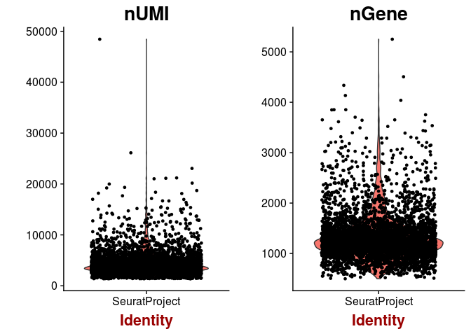<!-- -->

```r
plot(sobj@meta.data$nUMI, sobj@meta.data$nGene, pch=20, cex=0.5)
```

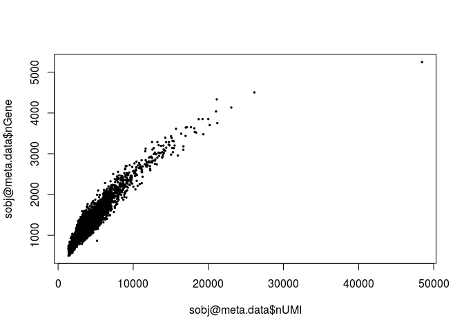<!-- -->


```r
mito.genes <- grep("^MT-", rownames(sobj@data), value = TRUE)
percent.mito <- Matrix::colSums(sobj@data[mito.genes, ]) / Matrix::colSums(sobj@data)
sobj <- AddMetaData(sobj, metadata = percent.mito, col.name = "percent.mito")

VlnPlot(sobj, features.plot = c("nUMI", "nGene", "percent.mito"))
```

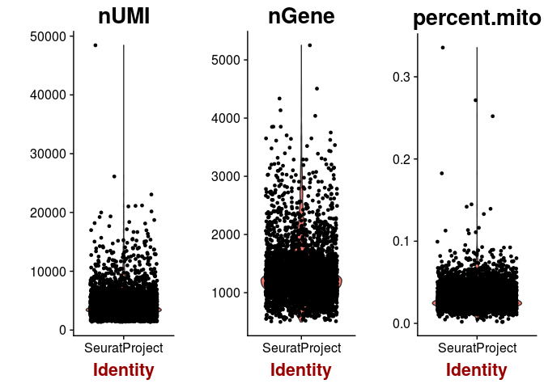<!-- -->

```r
plot(sobj@meta.data$nUMI, sobj@meta.data$percent.mito, pch=20, cex=0.5)
```

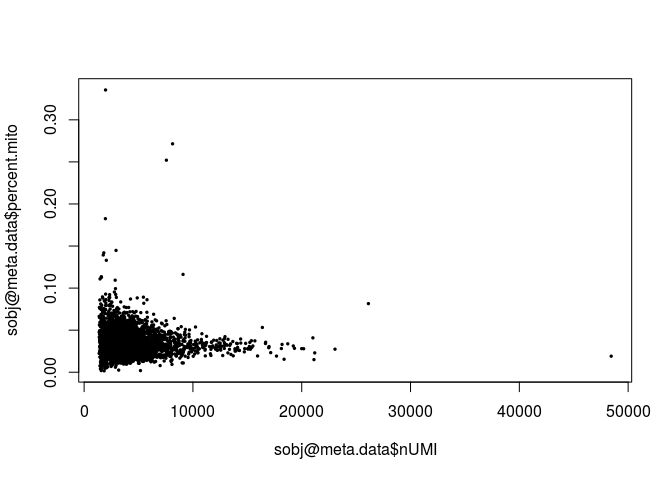<!-- -->


```r
sobj <- FilterCells(sobj, subset.names = "nGene", high.thresholds = 3000)
sobj <- FilterCells(sobj, subset.names = "percent.mito", high.thresholds = 0.1)

dim(sobj@data)
```

```
## [1] 15411  4272
```

</details>

### Exercise 2: Normalize the raw counts

<details><summary><b>Click Here to see one solution</b></summary>


```r
sobj <- NormalizeData(sobj, normalization.method = "LogNormalize", scale.factor = median(sobj@meta.data$nUMI))
```

</details>

### Exercise 3: Select a subset of highly variable genes to use for dimensionality reduction and clustering

*Hint: Aim for a subset of 1,000 to 2,000 genes.* 

<details><summary><b>Click Here to see one solution</b></summary>


```r
sobj <- FindVariableGenes(sobj, mean.function = ExpMean, dispersion.function = LogVMR,  
                          x.low.cutoff = 0.0125, x.high.cutoff = 3, y.cutoff = 0.5)
```

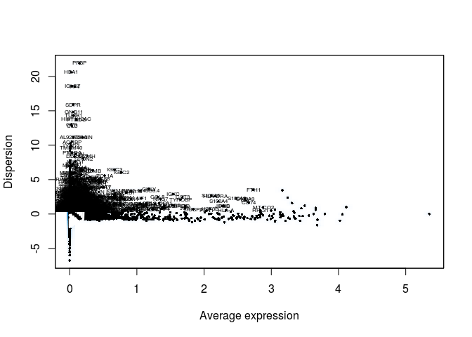<!-- -->

```r
length(sobj@var.genes)
```

```
## [1] 1252
```


```r
hvginfo <- sobj@hvg.info[ sobj@var.genes, ]
highest.dispersion <- head(rownames(hvginfo)[ order(-hvginfo$gene.dispersion) ])
highest.mean <- head(rownames(hvginfo)[ order(-hvginfo$gene.mean) ])

VlnPlot(sobj, features.plot = highest.dispersion, point.size.use=0.5)
```

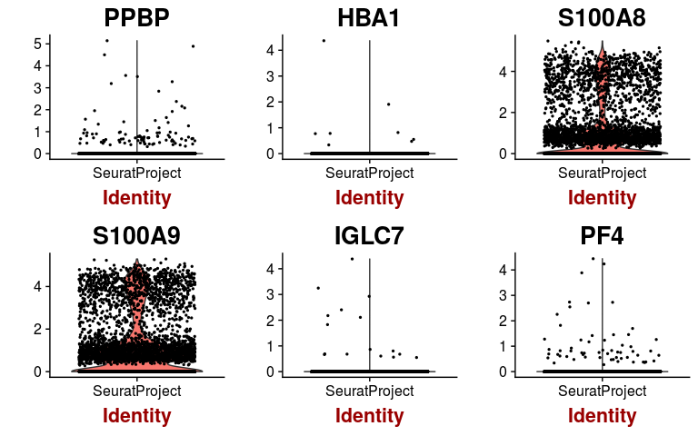<!-- -->

```r
VlnPlot(sobj, features.plot = highest.mean, point.size.use=0.5)
```

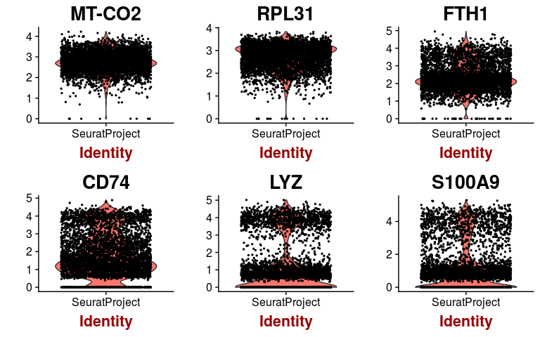<!-- -->

</details>

### Exercise 4: Scale the normalized matrix, and perform a principal component analysis (PCA) 

After obtaining and visualizing the PCA, determine the number of PCs you are going to use for further analysis.

<details><summary><b>Click Here to see one solution</b></summary>


```r
sobj <- ScaleData(object = sobj, vars.to.regress = c("nUMI", "percent.mito"))
```

```
## Regressing out: nUMI, percent.mito
```

```
## 
## Time Elapsed:  21.6098577976227 secs
```

```
## Scaling data matrix
```


```r
sobj <- RunPCA(object = sobj, pc.genes = sobj@var.genes, pcs.compute = 40, do.print=FALSE)

p1 <- PCAPlot(object = sobj, dim.1 = 1, dim.2 = 2, do.return=TRUE) + theme(legend.pos="none")
p2 <- PCAPlot(object = sobj, dim.1 = 2, dim.2 = 3, do.return=TRUE) + theme(legend.pos="none")
grid.arrange(p1, p2, ncol=2)
```

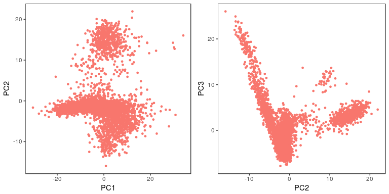<!-- -->


```r
PCElbowPlot(sobj, num.pc = 40)
```

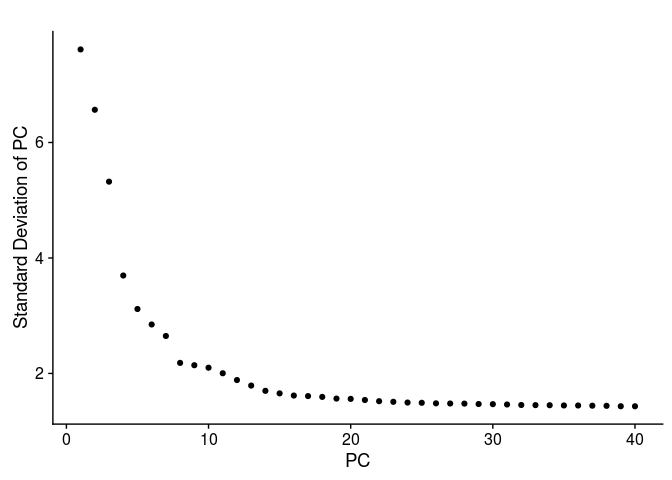<!-- -->


```r
PCHeatmap(sobj, pc.use = 1:15, cells.use = 500, do.balanced = TRUE, label.columns = FALSE)
```

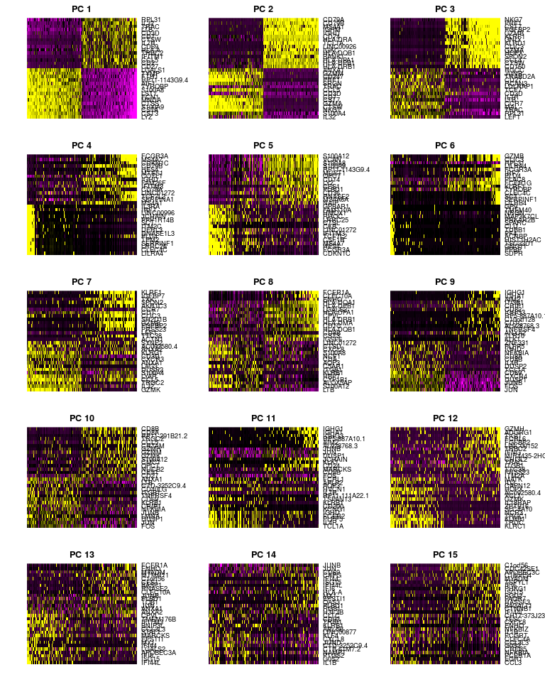<!-- -->

```r
VizPCA(sobj, pcs.use = 1:15, do.balanced = TRUE)
```

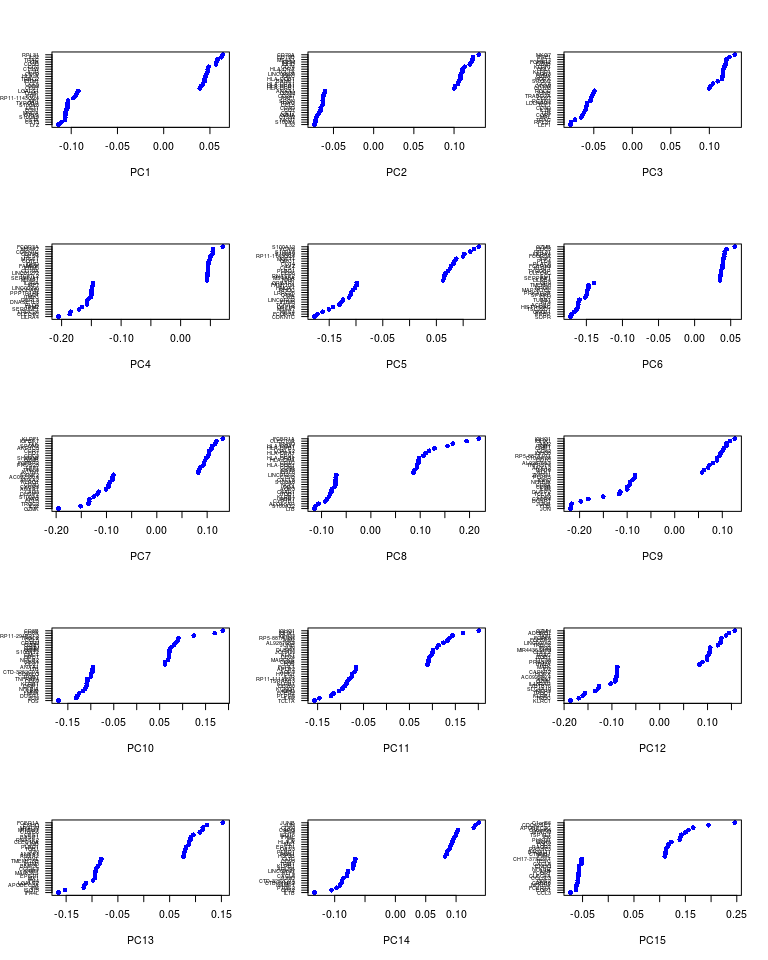<!-- -->


```r
# sobj <- JackStraw(sobj, num.pc = 40, num.replicate = 50, do.par=TRUE, display.progress = FALSE)
# sobj <- JackStrawPlot(sobj, PCs = 1:40)
# 
# plot(1:40, -log10(sobj@dr$pca@jackstraw@overall.p.values[,2]))
# abline(h=-log10(0.05))
```

</details>

### Exercise 5: Cluster the cells in the expression matrix and represent the clusters in a t-SNE plot

Try to select an appropriate value for the clustering `resolution` parameter, and the `perplexity` parameter of the t-SNE.

<details><summary><b>Click Here to see one solution</b></summary>


```r
sobj <- FindClusters(sobj, reduction.type = "pca", dims.use = 1:15, 
    resolution = 0.8, print.output = 0, save.SNN = FALSE)

sobj <- RunTSNE(sobj, dims.use = 1:15, do.fast = TRUE, perplexity = 30)
TSNEPlot(sobj, do.label = TRUE)
```

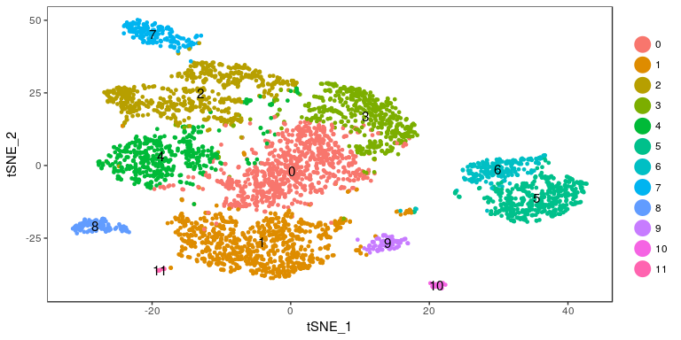<!-- -->

</details>

### Exercise 6: Find marker genes for all clusters

Examine the top markers for all clusters, and determine if any of the clusters seem to be very similar. If this is the case, group similar clusters together, and repeat the marker gene discovery on the new clusters.

<details><summary><b>Click Here to see one solution</b></summary>


```r
markers <- FindAllMarkers(object = sobj, only.pos = TRUE, min.pct = 0.25, thresh.use = 0.25)
markers <- markers[ markers$p_val_adj < 0.01, ]

head(markers)
```

```
##               p_val avg_logFC pct.1 pct.2     p_val_adj cluster  gene
## RPL21 9.595436e-177 0.3426853 1.000 0.999 1.478753e-172       0 RPL21
## RPS27 5.806036e-170 0.3684605 1.000 1.000 8.947683e-166       0 RPS27
## RPL31 5.196314e-163 0.4276901 0.998 0.997 8.008040e-159       0 RPL31
## RPL32 1.498597e-162 0.3333247 1.000 1.000 2.309487e-158       0 RPL32
## RPL34 1.495631e-161 0.3295687 1.000 0.999 2.304916e-157       0 RPL34
## RPS14 3.348956e-158 0.3324048 1.000 1.000 5.161076e-154       0 RPS14
```


```r
top.markers <- do.call(rbind, lapply(split(markers, markers$cluster), head))
DoHeatmap(sobj, genes.use = top.markers$gene, slim.col.label = TRUE, remove.key = TRUE)
```

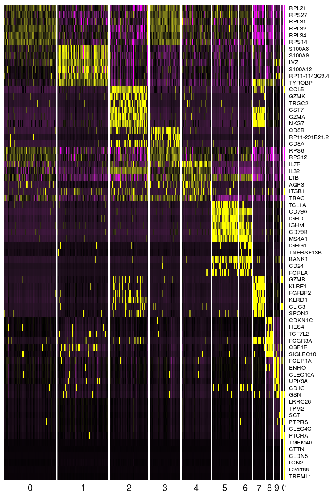<!-- -->

</details>

### Exercise 7: Identify cell subpolulations

Use the `VlnPlot` and `FeaturePlot` functions to examine the expresssion of the marker genes below. Can you indentify some of the cell subpopulations?  

| Markers | Cell Type |
|:--------|:----------|
| IL7R	  | CD4 T cells |
|	CD14, LYZ	| CD14+ Monocytes |
|	MS4A1 |	B cells |
|	CD8A | CD8 T cells |
|	FCGR3A, MS4A7	FCGR3A+ | Monocytes |
|	GNLY, NKG7	| NK cells |
|	FCER1A, CST3	| Dendritic Cells |
|	PPBP	| Megakaryocytes |

<details><summary><b>Click Here to see one solution</b></summary>


```r
VlnPlot(sobj, features.plot = c("IL7R", "MS4A1"), point.size.use=0.2)
```

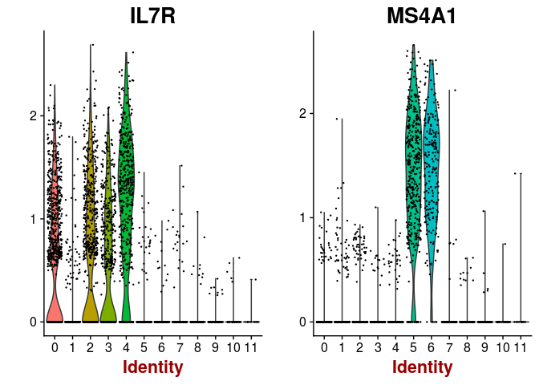<!-- -->

```r
VlnPlot(sobj, features.plot = c("CD14", "LYZ", "FCGR3A", "MS4A7"), point.size.use=0.2)
```

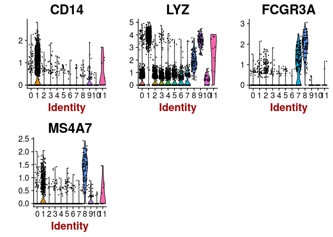<!-- -->

```r
VlnPlot(sobj, features.plot = c("MS4A1"), point.size.use=0.2)
```

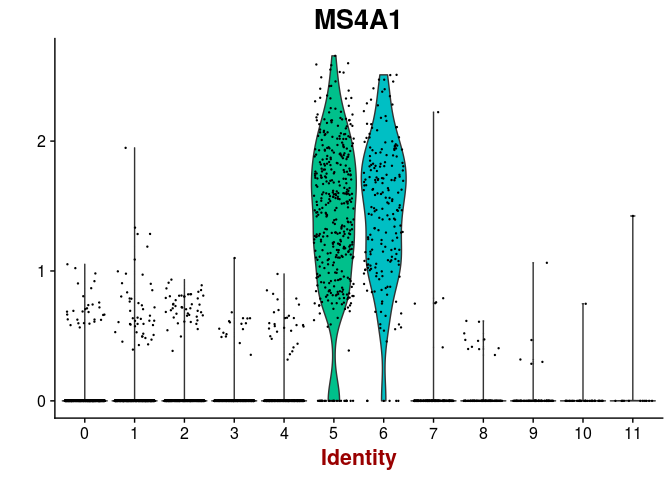<!-- -->

```r
VlnPlot(sobj, features.plot = c("FCER1A", "CST3"), point.size.use=0.2)
```

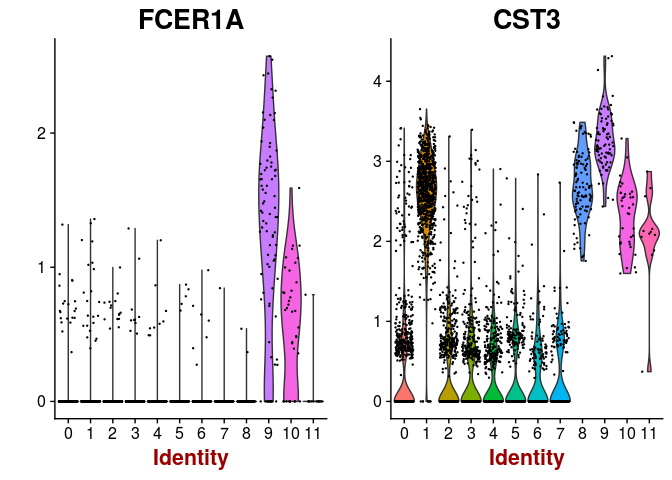<!-- -->

```r
VlnPlot(sobj, features.plot = c("PPBP"), point.size.use=0.2)
```

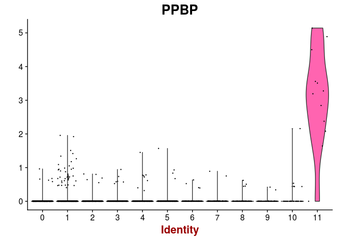<!-- -->


```r
FeaturePlot(sobj, features.plot = c("IL7R", "MS4A1"), cols.use=c("grey", "red"), pt.size=0.5)
```

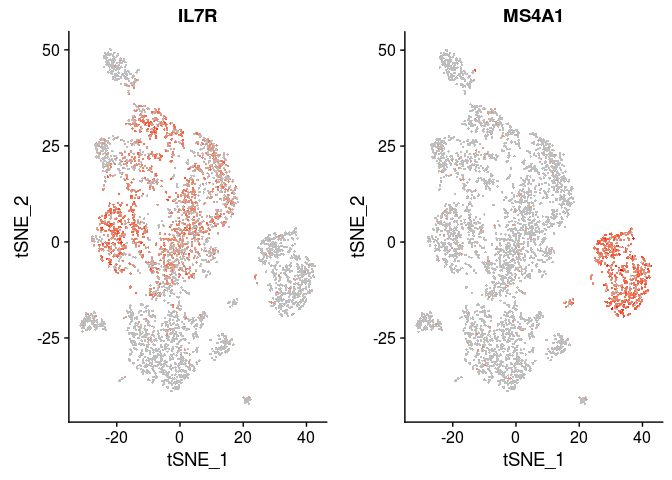<!-- -->

```r
FeaturePlot(sobj, features.plot = c("CD14", "LYZ", "FCGR3A", "MS4A7"), cols.use=c("grey", "red"), pt.size=0.5)
```

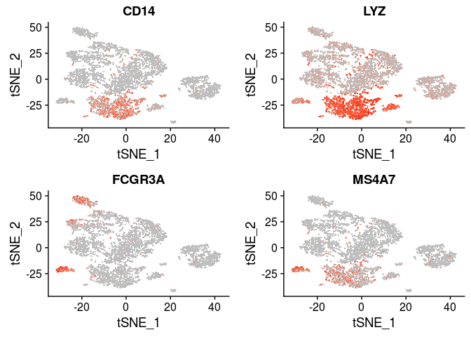<!-- -->

```r
FeaturePlot(sobj, features.plot = c("MS4A1"), cols.use=c("grey", "red"), pt.size=0.5)
```

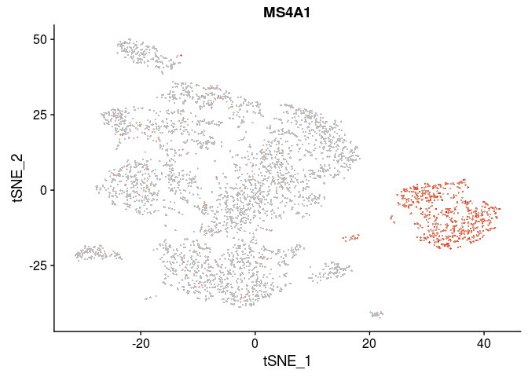<!-- -->

```r
FeaturePlot(sobj, features.plot = c("FCER1A", "CST3"), cols.use=c("grey", "red"), pt.size=0.5)
```

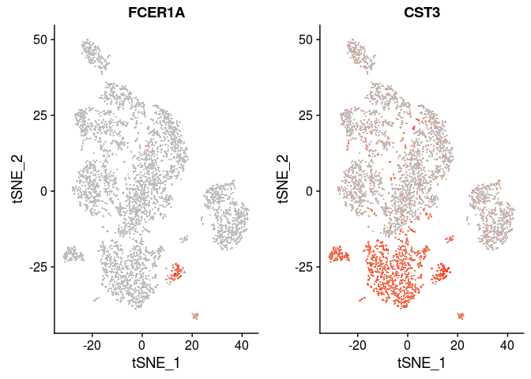<!-- -->

```r
FeaturePlot(sobj, features.plot = c("PPBP"), cols.use=c("grey", "red"), pt.size=0.5)
```

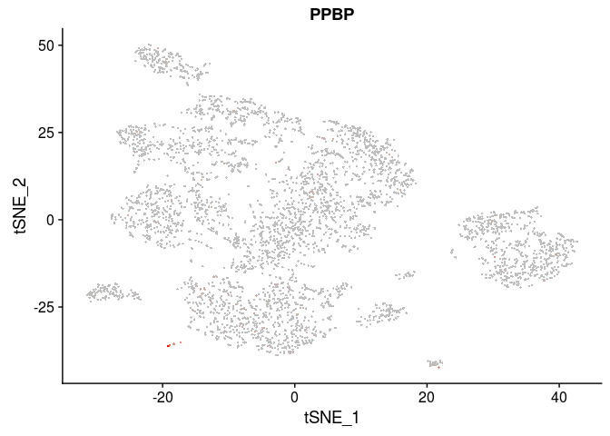<!-- -->

</details>

## Session Information


```r
sessionInfo()
```

```
## R version 3.4.4 (2018-03-15)
## Platform: x86_64-pc-linux-gnu (64-bit)
## Running under: Ubuntu 16.04.4 LTS
## 
## Matrix products: default
## BLAS: /usr/lib/libblas/libblas.so.3.6.0
## LAPACK: /usr/lib/lapack/liblapack.so.3.6.0
## 
## locale:
##  [1] LC_CTYPE=pt_PT.UTF-8       LC_NUMERIC=C              
##  [3] LC_TIME=pt_PT.UTF-8        LC_COLLATE=en_US.UTF-8    
##  [5] LC_MONETARY=pt_PT.UTF-8    LC_MESSAGES=en_US.UTF-8   
##  [7] LC_PAPER=pt_PT.UTF-8       LC_NAME=C                 
##  [9] LC_ADDRESS=C               LC_TELEPHONE=C            
## [11] LC_MEASUREMENT=pt_PT.UTF-8 LC_IDENTIFICATION=C       
## 
## attached base packages:
## [1] stats     graphics  grDevices utils     datasets  methods   base     
## 
## other attached packages:
## [1] bindrcpp_0.2.2 gridExtra_2.3  Seurat_2.3.3   Matrix_1.2-14 
## [5] cowplot_0.9.2  ggplot2_2.2.1 
## 
## loaded via a namespace (and not attached):
##   [1] tsne_0.1-3           segmented_0.5-3.0    nlme_3.1-137        
##   [4] bitops_1.0-6         bit64_0.9-7          RColorBrewer_1.1-2  
##   [7] rprojroot_1.3-2      prabclus_2.2-6       tools_3.4.4         
##  [10] backports_1.1.2      irlba_2.3.2          R6_2.2.2            
##  [13] rpart_4.1-13         KernSmooth_2.23-15   Hmisc_4.1-1         
##  [16] lazyeval_0.2.1       colorspace_1.3-2     trimcluster_0.1-2   
##  [19] nnet_7.3-12          tidyselect_0.2.4     diffusionMap_1.1-0  
##  [22] bit_1.1-12           compiler_3.4.4       htmlTable_1.11.1    
##  [25] hdf5r_1.0.0          labeling_0.3         diptest_0.75-7      
##  [28] caTools_1.17.1       scales_1.0.0         checkmate_1.8.5     
##  [31] lmtest_0.9-35        DEoptimR_1.0-8       mvtnorm_1.0-6       
##  [34] robustbase_0.92-8    ggridges_0.5.0       pbapply_1.3-4       
##  [37] dtw_1.18-1           proxy_0.4-21         stringr_1.3.1       
##  [40] digest_0.6.16        mixtools_1.1.0       foreign_0.8-70      
##  [43] rmarkdown_1.9        R.utils_2.6.0        base64enc_0.1-3     
##  [46] pkgconfig_2.0.2      htmltools_0.3.6      htmlwidgets_1.2     
##  [49] rlang_0.2.2          rstudioapi_0.7       bindr_0.1.1         
##  [52] jsonlite_1.5         zoo_1.8-1            ica_1.0-1           
##  [55] mclust_5.4           gtools_3.5.0         acepack_1.4.1       
##  [58] dplyr_0.7.6          R.oo_1.21.0          magrittr_1.5        
##  [61] modeltools_0.2-21    Formula_1.2-2        lars_1.2            
##  [64] Rcpp_0.12.18         munsell_0.5.0        reticulate_1.5      
##  [67] ape_5.1              R.methodsS3_1.7.1    scatterplot3d_0.3-40
##  [70] stringi_1.2.4        yaml_2.2.0           MASS_7.3-50         
##  [73] flexmix_2.3-13       gplots_3.0.1         Rtsne_0.13          
##  [76] plyr_1.8.4           grid_3.4.4           parallel_3.4.4      
##  [79] gdata_2.18.0         crayon_1.3.4         doSNOW_1.0.16       
##  [82] lattice_0.20-35      splines_3.4.4        SDMTools_1.1-221    
##  [85] knitr_1.20           pillar_1.3.0         igraph_1.2.1        
##  [88] fpc_2.1-10           reshape2_1.4.3       codetools_0.2-15    
##  [91] stats4_3.4.4         glue_1.3.0           evaluate_0.10.1     
##  [94] metap_0.9            latticeExtra_0.6-28  data.table_1.11.4   
##  [97] png_0.1-7            foreach_1.4.4        tidyr_0.8.1         
## [100] gtable_0.2.0         RANN_2.5.1           purrr_0.2.5         
## [103] kernlab_0.9-25       assertthat_0.2.0     class_7.3-14        
## [106] survival_2.42-3      tibble_1.4.2         snow_0.4-2          
## [109] iterators_1.0.9      cluster_2.0.6        fitdistrplus_1.0-9  
## [112] ROCR_1.0-7
```

## References

- https://satijalab.org/seurat/pbmc3k_tutorial.html

<br/>

### Back

Back to [previous page](L09.md#seurat-pbmc4k).
