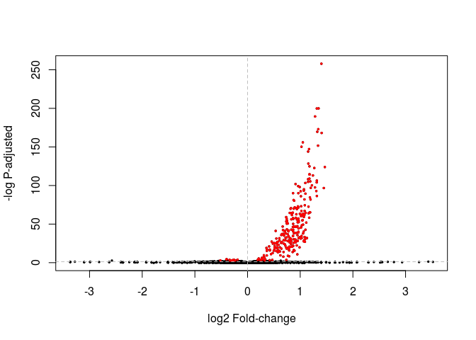
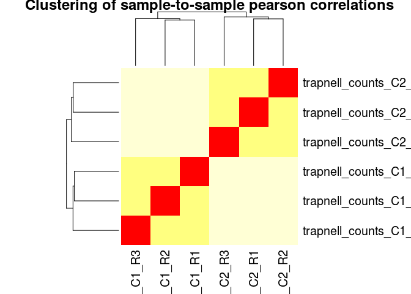
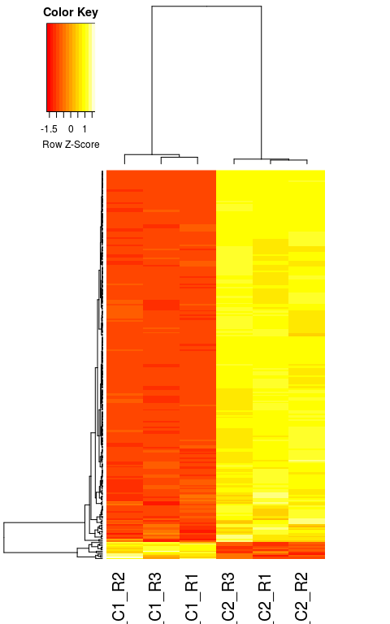
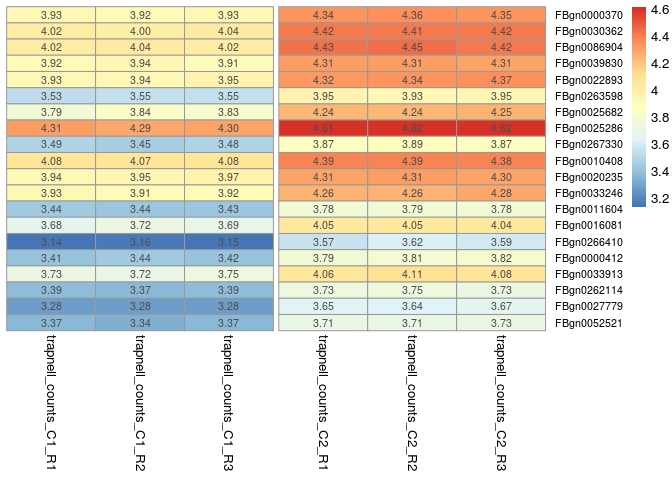

This document demonstrates how to use *DESeq2* in the *R environment* to perform a differential expression analysis using the the Trapnell datasets as an example. We will first need to tell R what samples are going to be analysed, then run the *DESeq2* pipeline and plot the results of the analysis.
<br/>

## Setting up the environment

First we need to make sure that R is running on the same directory where we placed the counts files (the files called trapnell_counts_C1_R1.tab, trapnell_counts_C1_R2.tab, etc...). To do this either type `setwd("path/to/directory")` in the R console, or use the *Files* panel to navigate to the counts directory and then select *More -> Set As Working Directory*.
<br/>

## Setting up the count data and metadata

In this example, instead of loading the sample counts ourselves, we are going to let *DESeq2* handle that for us. For this, we just need to tell *DESeq2* what files correspond to each sample. We start by setting variables to hold the list of samples we are going to analyze. We create a list of sample names, a list of sample files (where the counts are), and a list of experimental conditions, telling which samples correspond to each condition. Type the following lines in the R console and press Enter.


```r
sampleNames <- c("trapnell_counts_C1_R1", "trapnell_counts_C1_R2", "trapnell_counts_C1_R3", "trapnell_counts_C2_R1", "trapnell_counts_C2_R2", "trapnell_counts_C2_R3")

sampleFiles <- c("trapnell_counts_C1_R1.tab", "trapnell_counts_C1_R2.tab", "trapnell_counts_C1_R3.tab", "trapnell_counts_C2_R1.tab", "trapnell_counts_C2_R2.tab", "trapnell_counts_C2_R3.tab")

sampleConditions <- c("C1", "C1", "C1", "C2", "C2", "C2")
```

We can confirm the values in these variables by simply typing a variable name in the R console and pressing Enter.


```r
sampleNames
```

```
## [1] "trapnell_counts_C1_R1" "trapnell_counts_C1_R2" "trapnell_counts_C1_R3"
## [4] "trapnell_counts_C2_R1" "trapnell_counts_C2_R2" "trapnell_counts_C2_R3"
```

```r
sampleFiles
```

```
## [1] "trapnell_counts_C1_R1.tab" "trapnell_counts_C1_R2.tab"
## [3] "trapnell_counts_C1_R3.tab" "trapnell_counts_C2_R1.tab"
## [5] "trapnell_counts_C2_R2.tab" "trapnell_counts_C2_R3.tab"
```

```r
sampleConditions
```

```
## [1] "C1" "C1" "C1" "C2" "C2" "C2"
```

For convenience, we place this information in a table variable that we call `sampleTable`.


```r
sampleTable <- data.frame(sampleName = sampleNames,
                          fileName = sampleFiles,
                          condition = sampleConditions)

sampleTable
```

```
##              sampleName                  fileName condition
## 1 trapnell_counts_C1_R1 trapnell_counts_C1_R1.tab        C1
## 2 trapnell_counts_C1_R2 trapnell_counts_C1_R2.tab        C1
## 3 trapnell_counts_C1_R3 trapnell_counts_C1_R3.tab        C1
## 4 trapnell_counts_C2_R1 trapnell_counts_C2_R1.tab        C2
## 5 trapnell_counts_C2_R2 trapnell_counts_C2_R2.tab        C2
## 6 trapnell_counts_C2_R3 trapnell_counts_C2_R3.tab        C2
```
<br/>

## Running a differential expression test with DESeq2

With the sample table prepared, we are ready to run **DESeq2**. First need to import it into the R environment. This is done with the `library` command.


```r
library("DESeq2")
```

Then, we prepare a special structure to tell *DESeq2* what samples we are going to analyse (our sample table), and what comparison we are goind to make. By setting the `design` argument to `~ condition`, we are specifying that column as the experimental variable (C1 or C2).


```r
ddsHTSeq <- DESeqDataSetFromHTSeqCount(sampleTable = sampleTable,
                                       design= ~ condition)
```

We can run the whole DESeq2 pipeline with a single command. This will perform normalization of the raw counts, estimate variances, and perform the differential expression tests.


```r
ddsHTSeq <- DESeq(ddsHTSeq)
```

```
## estimating size factors
```

```
## estimating dispersions
```

```
## gene-wise dispersion estimates
```

```
## mean-dispersion relationship
```

```
## final dispersion estimates
```

```
## fitting model and testing
```

We can then extract the results of the differential expression in the form of a table using the `results` function. The `head` function will print the first lines of this table on the console.


```r
resHTSeq <- results(ddsHTSeq)

head(resHTSeq)
```

```
## log2 fold change (MLE): condition C2 vs C1 
## Wald test p-value: condition C2 vs C1 
## DataFrame with 6 rows and 6 columns
##               baseMean log2FoldChange      lfcSE       stat     pvalue
##              <numeric>      <numeric>  <numeric>  <numeric>  <numeric>
## FBgn0000003    0.00000             NA         NA         NA         NA
## FBgn0000008  578.61667    -0.01363018 0.09778363 -0.1393912 0.88914103
## FBgn0000014   98.25848     0.26279172 0.22066004  1.1909348 0.23367917
## FBgn0000015   65.03895     0.12821306 0.26373025  0.4861523 0.62685920
## FBgn0000017 2539.89350     0.11317799 0.05904858  1.9166927 0.05527698
## FBgn0000018  327.26607    -0.06538546 0.12276560 -0.5326041 0.59430768
##                  padj
##             <numeric>
## FBgn0000003        NA
## FBgn0000008 0.9992327
## FBgn0000014 0.9515670
## FBgn0000015        NA
## FBgn0000017 0.6446372
## FBgn0000018 0.9992327
```

*Hint: you can type `View(resHTSeq)` to open the full table in a separate window*

We can ask how many genes are differentially expressed (using a cutoff of 0.05) with this command.


```r
table(resHTSeq$padj < 0.05)
```

```
## 
## FALSE  TRUE 
##  6322   267
```

**Question**: How many genes have padj less than 0.01? How many genes have nominal p-values less than 0.01?

<details><summary><b>Click Here to see the answer</b></summary>


<pre>
table(resHTSeq$padj < 0.01)
</pre>

<pre>
## 
## FALSE  TRUE 
##  6330   259
</pre>

<pre>
table(resHTSeq$pvalue < 0.01)
</pre>

<pre>
## 
## FALSE  TRUE 
##  9893   315
</pre>

</details>

---

We sort this table by p-value (smaller p-values on top), and save it to a file so that we can later import it into Excel. 


```r
orderedRes <- resHTSeq[ order(resHTSeq$padj), ]

write.csv(as.data.frame(orderedRes), file="trapnell_C1_VS_C2.DESeq2.csv")
```

We can also retrieve and save a table of normalized counts. 


```r
normCounts <- counts(ddsHTSeq, normalized = TRUE)

head(normCounts)
```

```
##             trapnell_counts_C1_R1 trapnell_counts_C1_R2
## FBgn0000003               0.00000               0.00000
## FBgn0000008             601.61191             601.95507
## FBgn0000014              88.44375              78.64252
## FBgn0000015              70.94939              65.04998
## FBgn0000017            2593.05424            2334.03223
## FBgn0000018             318.78628             333.01708
##             trapnell_counts_C1_R3 trapnell_counts_C2_R1
## FBgn0000003                0.0000               0.00000
## FBgn0000008              540.4924             544.48136
## FBgn0000014              100.9178              89.20881
## FBgn0000015               50.4589              56.39637
## FBgn0000017             2393.8864            2614.74099
## FBgn0000018              352.2419             311.71814
##             trapnell_counts_C2_R2 trapnell_counts_C2_R3
## FBgn0000003               0.00000               0.00000
## FBgn0000008             622.53341             560.62587
## FBgn0000014             127.98795             104.35007
## FBgn0000015              72.69716              74.68191
## FBgn0000017            2672.38848            2631.25864
## FBgn0000018             294.88425             352.94877
```

```r
write.csv(as.data.frame(orderedRes), file="trapnell_normCounts.DESeq2.csv")
```

Finally, we can merge the two tables into a single one.


```r
merged.results <- merge(normCounts, orderedRes, by="row.names")

head(merged.results)
```

```
##     Row.names trapnell_counts_C1_R1 trapnell_counts_C1_R2
## 1 FBgn0000003               0.00000               0.00000
## 2 FBgn0000008             601.61191             601.95507
## 3 FBgn0000014              88.44375              78.64252
## 4 FBgn0000015              70.94939              65.04998
## 5 FBgn0000017            2593.05424            2334.03223
## 6 FBgn0000018             318.78628             333.01708
##   trapnell_counts_C1_R3 trapnell_counts_C2_R1 trapnell_counts_C2_R2
## 1                0.0000               0.00000               0.00000
## 2              540.4924             544.48136             622.53341
## 3              100.9178              89.20881             127.98795
## 4               50.4589              56.39637              72.69716
## 5             2393.8864            2614.74099            2672.38848
## 6              352.2419             311.71814             294.88425
##   trapnell_counts_C2_R3   baseMean log2FoldChange      lfcSE       stat
## 1               0.00000    0.00000             NA         NA         NA
## 2             560.62587  578.61667    -0.01363018 0.09778363 -0.1393912
## 3             104.35007   98.25848     0.26279172 0.22066004  1.1909348
## 4              74.68191   65.03895     0.12821306 0.26373025  0.4861523
## 5            2631.25864 2539.89350     0.11317799 0.05904858  1.9166927
## 6             352.94877  327.26607    -0.06538546 0.12276560 -0.5326041
##       pvalue      padj
## 1         NA        NA
## 2 0.88914103 0.9992327
## 3 0.23367917 0.9515670
## 4 0.62685920        NA
## 5 0.05527698 0.6446372
## 6 0.59430768 0.9992327
```
<br/>

**Exercise**: When merging the two tables, we lost the ordering by p-value. Can you reorder the `merged.results` table by p.value?

<details><summary><b>Click Here to see the answer</b></summary>


<pre>
merged.results <- merged.results[ order(merged.results$padj), ]
head(merged.results)
</pre>

<pre>
##         Row.names trapnell_counts_C1_R1 trapnell_counts_C1_R2
## 124   FBgn0000370              8501.291              8316.689
## 3545  FBgn0030362             10506.340             10111.874
## 13110 FBgn0086904             10371.245             10938.106
## 9801  FBgn0039830              8337.039              8705.047
## 2063  FBgn0022893              8526.561              8671.066
## 14818 FBgn0263598              3419.177              3536.001
##       trapnell_counts_C1_R3 trapnell_counts_C2_R1 trapnell_counts_C2_R2
## 124                8562.486              22004.84             22694.824
## 3545              10902.032              26508.35             25890.427
## 13110             10568.227              27030.27             28008.884
## 9801               8094.771              20488.29             20395.136
## 2063               8991.387              21115.83             22103.008
## 14818              3565.115               8983.43              8519.902
##       trapnell_counts_C2_R3  baseMean log2FoldChange      lfcSE     stat
## 124               22378.998 15409.855       1.402136 0.04082003 34.34921
## 3545              26029.204 18324.704       1.315089 0.04352489 30.21463
## 13110             26143.785 18843.419       1.348634 0.04462244 30.22321
## 9801              20257.213 14379.583       1.282328 0.04359018 29.41781
## 2063              23197.430 15434.213       1.342575 0.04778029 28.09893
## 14818              8828.834  6142.077       1.323648 0.04757299 27.82351
##              pvalue          padj
## 124   1.447240e-258 9.535863e-255
## 3545  1.521793e-200 3.342366e-197
## 13110 1.173879e-200 3.342366e-197
## 9801  3.250763e-190 5.354819e-187
## 2063  1.009490e-173 1.330306e-170
## 14818 2.253991e-170 2.475257e-167
</pre>

</details>
<br/>

## Visualizing results

*DESeq2* provides several functions to visualize the results, while additional plots can be made using the extensive R graphics capabilities. Visualization can help to better understand the results, and catch potential problems in the data and analysis. We start here by reproducing the plots that we previously obtained using Galaxy.
<br/>

### Dispersion plot

We can plot the *DESeq2* dispersion re-estimation procedure by typing:


```r
plotDispEsts(ddsHTSeq)
```


<br/>

### P-value distribution

As a sanity check, we can inspect the distribution of p-values using the `hist` function.


```r
hist(resHTSeq$pvalue, breaks=0:50/50, xlab="p value", main="Histogram of nominal p values")
```


<br/>

### MA-plot

To make an (unshrunken) **MA-plot**, that displays the relationship between a genes' mean expression and its fold-change between experimental conditions, type the following in the R console. 


```r
plotMA(resHTSeq)
```


To obtain an **MA-plot** with shrunken log2 fold-changes we use the `lfcShrink` function. This function is equivalent to the `results` function that we called previously, but will return a table with the *log2FoldChange* and *lfcSE* columns replaced with the shrunken values. The `coef` argument is used to specify what *contrast* we are interested in analysing (in this case condition_C2_vs_C1), so we first call `resultsNames` to determine the right coefficient.


```r
resultsNames(ddsHTSeq)
```

```
## [1] "Intercept"          "condition_C2_vs_C1"
```

```r
resHTSeqShrunk <- lfcShrink(ddsHTSeq, coef=2)
plotMA(resHTSeqShrunk)
```


<br/>

### Volcano plot

A **Volcano plot** displays the relationship between fold-change and evidence of differential expression (represented as -log p-adusted). *DESeq2* doesn't provide a function to display a **Volcano plot**, but we can create one using R's base plot functions. In red we highlight genes differentially expressed with Padj < 0.05.


```r
highlight <- which(resHTSeq$padj < 0.05)

plot(resHTSeq$log2FoldChange, -log10(resHTSeq$pvalue), xlab="log2 Fold-change", ylab="-log P-adjusted", pch=20, cex=0.5)
points(resHTSeq$log2FoldChange[ highlight ], -log10(resHTSeq$pvalue[ highlight ]), col="red", pch=20, cex=0.5)
abline(v=0, h=-log10(0.05), lty="dashed", col="grey")
```



**Exercise**: Change the commands above to make a **volcano plot** using the shrunken log fold changes instead. Also change the threshold of differential expression to 0.01 and the color of the differentially expressed genes to green.

<details><summary><b>Click Here to see the answer</b></summary>


<pre>
highlight <- which(resHTSeqShrunk$padj < 0.01)

plot(resHTSeqShrunk$log2FoldChange, -log10(resHTSeqShrunk$pvalue), xlab="shrunken log2 Fold-change", ylab="-log P-adjusted", pch=20, cex=0.5)
points(resHTSeqShrunk$log2FoldChange[ highlight ], -log10(resHTSeqShrunk$pvalue[ highlight ]), col="green", pch=20, cex=0.5)
abline(v=0, h=-log10(0.01), lty="dashed", col="grey")
</pre>


</details>

---
<br/>

### Principal component analysis (PCA)

*DESeq2* provides a function to make a Principal Component Analysis (PCA) of the count data. The *DESeq2* [vignette](http://bioconductor.org/packages/devel/bioc/vignettes/DESeq2/inst/doc/DESeq2.html#count-data-transformations) recommends using transformed counts as input to the PCA routines, as these transformations remove the dependence of the sample-to-sample variance on the genes' mean expression. 

One such transformations is the variance stabilizing transformation (VST). You can type `?varianceStabilizingTransformation` to learn more about this. To compare samples in an manner unbiased by prior information (i.e. the experimental condition), the `blind` argument is set to TRUE.


```r
transformed.vsd <- varianceStabilizingTransformation(ddsHTSeq, blind=TRUE)
```

```
## -- note: fitType='parametric', but the dispersion trend was not well captured by the
##    function: y = a/x + b, and a local regression fit was automatically substituted.
##    specify fitType='local' or 'mean' to avoid this message next time.
```

```r
plotPCA(transformed.vsd)
```


### Sample-to-sample correlation heatmap

Another common visualization of high-throughput datasets is a clustered heatmap of sample-to-sample distances (or correlations). This visualization groups togheter the samples that are more similar to each other. 

To make this visualization we first calculate a matrix of distances between all pairs of samples. Then we use the `heatmap` (from the base R package) to cluster and display the heatmap. 


```r
dists <- as.matrix(dist(t(normCounts)))
heatmap(dists, main="Clustering of sample-to-sample distances", scale="none")
```
<br/>
  


We can also use pearson (or spearman) correlations as a distance metric. This is more robust than simple euclidean distances, and has the advantage that we can even use the raw (non-normalized) counts as input. It is generally a good idea to log transform the counts first.


```r
log10_rawCounts <- log10(counts(ddsHTSeq) + 1)
  
dists <- 1 - cor(log10_rawCounts, method="pearson")
heatmap(dists, main="Clustering of sample-to-sample pearson correlations", scale="none")
```
<br/>



<br/>

## Other visualizations

Here we plot the relative expression of all differentially expressed genes in the 6 samples. This figure is useful to visualize the differences in expression between samples. 


```r
library(gplots)
```

```
## 
## Attaching package: 'gplots'
```

```
## The following object is masked from 'package:IRanges':
## 
##     space
```

```
## The following object is masked from 'package:S4Vectors':
## 
##     space
```

```
## The following object is masked from 'package:stats':
## 
##     lowess
```

```r
diffgenes <- rownames(resHTSeq)[ which(resHTSeq$padj < 0.05) ]
diffcounts <- normCounts[ diffgenes, ]

heatmap.2(diffcounts, 
          labRow = "", 
          trace = "none", density.info = "none",
          scale = "row",
          distfun = function(x) as.dist(1 - cor(t(x))))
```



The following commands are used to plot a heatmap of the 20 most differentially expressed genes. For this, we use the ordered results table to determine which genes are most differentially expressed, and then plot the values from the normalized counts table (transformed to log10).


```r
library(pheatmap)

# select the 20 most differentially expressed genes
select <- row.names(orderedRes[1:20, ])

# transform the counts to log10
log10_normCounts <- log10(normCounts + 1)

# get the values for the selected genes
values <- log10_normCounts[ select, ]

pheatmap(values,
         scale = "none", 
         cluster_rows = FALSE, 
         cluster_cols = FALSE,
         fontsize_row = 8,
         annotation_names_col = FALSE,
         gaps_col = c(3,6),
         display_numbers = TRUE,
         number_format = "%.2f",         
         height=12,
         width=6)
```


<br/>

## Session information


```r
sessionInfo()
```

```
## R version 3.4.4 (2018-03-15)
## Platform: x86_64-pc-linux-gnu (64-bit)
## Running under: Ubuntu 16.04.4 LTS
## 
## Matrix products: default
## BLAS: /usr/lib/libblas/libblas.so.3.6.0
## LAPACK: /usr/lib/lapack/liblapack.so.3.6.0
## 
## locale:
##  [1] LC_CTYPE=pt_PT.UTF-8       LC_NUMERIC=C              
##  [3] LC_TIME=pt_PT.UTF-8        LC_COLLATE=en_US.UTF-8    
##  [5] LC_MONETARY=pt_PT.UTF-8    LC_MESSAGES=en_US.UTF-8   
##  [7] LC_PAPER=pt_PT.UTF-8       LC_NAME=C                 
##  [9] LC_ADDRESS=C               LC_TELEPHONE=C            
## [11] LC_MEASUREMENT=pt_PT.UTF-8 LC_IDENTIFICATION=C       
## 
## attached base packages:
## [1] parallel  stats4    stats     graphics  grDevices utils     datasets 
## [8] methods   base     
## 
## other attached packages:
##  [1] pheatmap_1.0.8             gplots_3.0.1              
##  [3] DESeq2_1.18.1              SummarizedExperiment_1.8.1
##  [5] DelayedArray_0.4.1         matrixStats_0.52.2        
##  [7] Biobase_2.38.0             GenomicRanges_1.30.1      
##  [9] GenomeInfoDb_1.14.0        IRanges_2.12.0            
## [11] S4Vectors_0.16.0           BiocGenerics_0.24.0       
## 
## loaded via a namespace (and not attached):
##  [1] bit64_0.9-7            splines_3.4.4          gtools_3.5.0          
##  [4] Formula_1.2-2          latticeExtra_0.6-28    blob_1.1.0            
##  [7] GenomeInfoDbData_1.0.0 yaml_2.2.0             pillar_1.3.0          
## [10] RSQLite_2.0            backports_1.1.2        lattice_0.20-35       
## [13] digest_0.6.16          RColorBrewer_1.1-2     XVector_0.18.0        
## [16] checkmate_1.8.5        colorspace_1.3-2       htmltools_0.3.6       
## [19] Matrix_1.2-14          plyr_1.8.4             XML_3.98-1.9          
## [22] genefilter_1.60.0      zlibbioc_1.24.0        xtable_1.8-2          
## [25] scales_1.0.0           gdata_2.18.0           BiocParallel_1.12.0   
## [28] htmlTable_1.11.1       tibble_1.4.2           annotate_1.56.1       
## [31] ggplot2_2.2.1          nnet_7.3-12            lazyeval_0.2.1        
## [34] survival_2.42-3        magrittr_1.5           crayon_1.3.4          
## [37] memoise_1.1.0          evaluate_0.10.1        foreign_0.8-70        
## [40] tools_3.4.4            data.table_1.11.4      stringr_1.3.1         
## [43] munsell_0.5.0          locfit_1.5-9.1         cluster_2.0.6         
## [46] AnnotationDbi_1.40.0   compiler_3.4.4         caTools_1.17.1        
## [49] rlang_0.2.2            grid_3.4.4             RCurl_1.95-4.10       
## [52] rstudioapi_0.7         htmlwidgets_1.2        bitops_1.0-6          
## [55] base64enc_0.1-3        labeling_0.3           rmarkdown_1.9         
## [58] gtable_0.2.0           DBI_0.7                gridExtra_2.3         
## [61] knitr_1.20             bit_1.1-12             Hmisc_4.1-1           
## [64] rprojroot_1.3-2        KernSmooth_2.23-15     stringi_1.2.4         
## [67] Rcpp_0.12.18           geneplotter_1.56.0     rpart_4.1-13          
## [70] acepack_1.4.1
```
<br/>

### Back

Back to [previous page](L08.md/#tutorial1).
